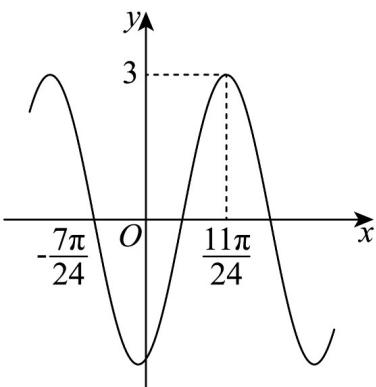

<!-- question-source:start -->
【变式3】已知函数 $f(x) = A\sin (\omega x + \varphi)$ （ $A > 0, \omega > 0, -\pi < \varphi < \pi$ ）的部分图象如图所示

(1)求 $f(x)$ 的解析式及单调递减区间；

(2)将函数 $y = f(x)$ 的图象向左平移 $\frac{\pi}{24}$ 个单位长度，再将所得图象上各点的横坐标变为原来的 $^{2}$ 倍（纵坐标不

变），得到函数 $y = g(x)$ 的图象·若对任意的 $x_{1}$ ， $x_{2} \in \left[\frac{\pi}{6}, \frac{13\pi}{12}\right]$ ，都有 $\left|g(x_{1}) - g(x_{2})\right| \leq 2a - 1$ ，求实数 $a$ 的取值

范围·
<!-- question-source:end -->

![[高中/课堂同步/题库/人教A版高中数学同步讲义(2026)/01_必修第一册/第五章 三角函数/专题5.4.1 正弦函数、余弦函数的图象（高效培优讲义）数学人教A版2019高一必修第一册/题型03_解三角不等式问题/questions/answers/Q00076339A1.md]]
