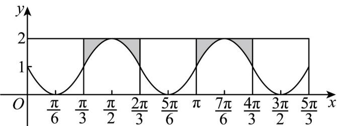

> [!faq]- 《专题5.4.1 正弦函数、余弦函数的图象（高效培优讲义）数学人教A版2019高一必修第一册》官方解析
>
> > [!success]- **【答案】** C
>
> > [!note]- **【解析】**
> > 作出函数 $y = 1 - \sin 3x$ 的图象，如图所示，
> >
> > 
> >
> > 利用割补法，将 $\frac{2}{3}\pi$ 到 $\pi$ 部分的图象与 $x$ 轴围成的图形补到图中 $\frac{\pi}{3}$ 到 $\frac{2}{3}\pi$ 处阴影部分，凑成一个长为 $\frac{\pi}{3}$ ，宽为
> >
> > 2 的长方形，后面 $\pi$ 到 $\frac{5}{3}\pi$ ，同理； $\therefore y=1-\sin3x$ 的图象与直线 $x=\frac{\pi}{3}$ ， $x=\frac{5}{3}\pi$ 及 x 轴所围成的面积为 $2\times\frac{2}{3}\pi=\frac{4}{3}\pi$
> >
> > 故选 **C**.
