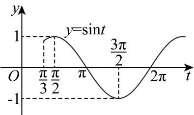

> [!faq]- 《专题5.4.1 正弦函数、余弦函数的图象（高效培优讲义）数学人教A版2019高一必修第一册》官方解析
>
> > [!success]- **【答案】** B
>
> > [!note]- **【解析】**
> > 对于 $f(x) = \sin (\omega x + \frac{\pi}{3})(\omega >0)$ ，因 $x\in (0,\pi)$ ，则 $t = \omega x + \frac{\pi}{3}\in (\frac{\pi}{3},\omega \pi +\frac{\pi}{3})$
> >
> > 作出函数 $y = \sin t$ 在 $t \in \left( \frac{\pi}{3}, \omega\pi + \frac{\pi}{3} \right)$ 上的图象，
> >
> > 
> >
> > 要使原函数在 $(0, \pi)$ 上有且仅有 $1$ 个零点和 $1$ 个最高点，需使 $\pi < \omega \pi + \frac{\pi}{3} \leq 2\pi$
> >
> > 解得 $\frac{2}{3} < \omega \leq \frac{5}{3}$ .
> >
> > 故选：B.
> >
> > ## 方法技巧
> >
> > 方程的根（或函数零点）问题：三角函数的图象是研究函数的重要工具，通过图象可较简便的解决问题，这正是数形结合思想方法的应用。
