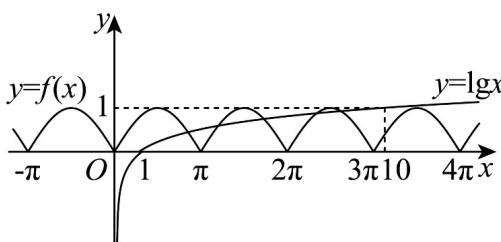

> [!faq]- 《专题5.4.1 正弦函数、余弦函数的图象（高效培优讲义）数学人教A版2019高一必修第一册》官方解析
>
> > [!success]- **【答案】** A. 5 B. 4 C. 3 D. 2
>
> > [!note]- **【解析】**
> > 画出 $f(x)=\left|\sin x\right|$ 和 $y=\lg x$ 的函数图象，
> >
> > 
> >
> > 因为 $\left|\sin x\right| \leq 1$ ， $\lg 10 = 1$
> >
> > 结合图象可得函数 $f(x)=\left|\sin x\right|$ 与函数 $y=\lg x$ 图象的交点个数是 5 个.
> >
> > 故选 **A**
