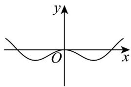
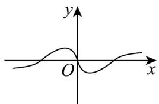
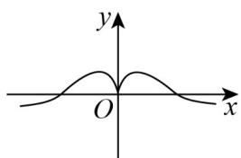
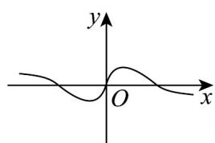

<!-- question-source:start -->
【典例1】函数 $f(x) = \left(\frac{\sin x}{\mathrm{e}^x + \mathrm{e}^{-x}}\right)\cos x$ 的部分图象可能是（）

A

B

C

D

<!-- question-source:end -->

![[高中/课堂同步/题库/人教A版高中数学同步讲义(2026)/01_必修第一册/第五章 三角函数/专题5.4.1 正弦函数、余弦函数的图象（高效培优讲义）数学人教A版2019高一必修第一册/题型05_识图问题/questions/answers/Q00076344A1.md]]
