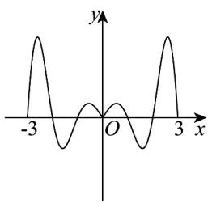
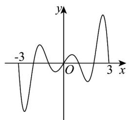
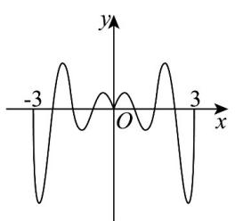
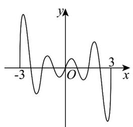

> [!faq]- 《专题5.4.1 正弦函数、余弦函数的图象（高效培优讲义）数学人教A版2019高一必修第一册》官方解析
>
> > [!success]- **【答案】** A  B  C  D 
>
> > [!note]- **【解析】**
> > 因为 $x\in [-3,3]$ ， $f(-x) = \frac{\mathrm{e}^{-x} + \mathrm{e}^x}{4}\cdot \sin (-\pi x) = -\frac{\mathrm{e}^x + \mathrm{e}^{-x}}{4}\cdot \sin \pi x = -f(x)$
> >
> > 且定义域关于原点对称，所以函数 $f(x)$ 为奇函数，其图象关于原点对称，排除选项A和C；
> >
> > 当 $2 < x < 3$ 时， $\frac{\mathrm{e}^x + \mathrm{e}^{-x}}{4} >0,\sin \pi x > 0$ ，所以 $f(x) = \frac{\mathrm{e}^x + \mathrm{e}^{-x}}{4}\cdot \sin \pi x > 0$
> >
> > 排除选项 D，只有选项 B 符合题意。
> >
> > 故选 **B**.
