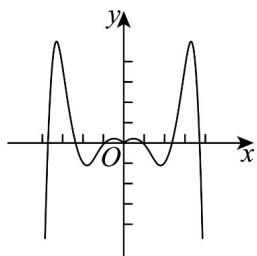
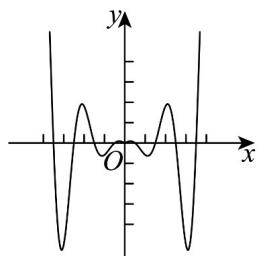
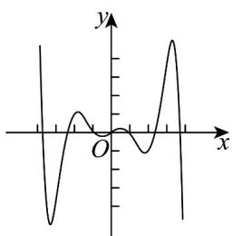
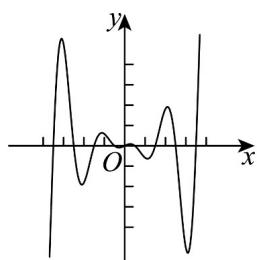

> [!faq]- 《专题5.4.1 正弦函数、余弦函数的图象（高效培优讲义）数学人教A版2019高一必修第一册》官方解析
>
> > [!success]- **【答案】** A  B  C  D 
>
> > [!note]- **【解析】**
> > 因为定义域关于原点对称，又 $f(-x) = \frac{1}{4}\cos (-\pi x)\cdot \left(\mathrm{e}^{-x} - \mathrm{e}^{x}\right) = -\frac{1}{4}\cos \pi x\cdot \left(\mathrm{e}^{x} - \mathrm{e}^{-x}\right) = -f(x)$ 即 $f(x) = \frac{1}{4}\cos \pi x\cdot \left(\mathrm{e}^{x} - \mathrm{e}^{-x}\right)$ 为奇函数，所以选项A和B错误，
> >
> > 又当 $x = \frac{7}{2}$ 时， $\cos \pi x = \cos \frac{7\pi}{2} = 0$ ，当 $x \in \left(\frac{7}{2}, 4\right)$ 时， $\pi x \in \left(\frac{7\pi}{2}, 4\pi\right)$ ，此时 $\cos \pi x > 0$
> >
> > B
> >
> > A
> >
> > 又易知当 x > 0 时， $e^{x} - e^{-x} > 0$ ，所以 $x \in \left(\frac{7}{2}, 4\right)$ 时， $f(x) > 0$ ，结合图象可知选项 C 错误，选项 D 正确，
> >
> > 故选 **D**.
