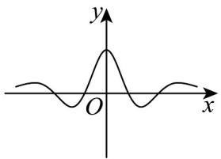
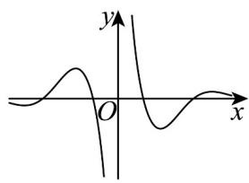
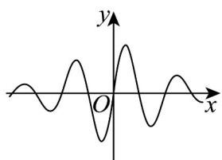
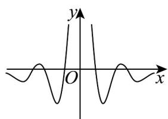

> [!faq]- 《专题5.4.1 正弦函数、余弦函数的图象（高效培优讲义）数学人教A版2019高一必修第一册》官方解析
>
> > [!success]- **【答案】**   C  D 
>
> > [!note]- **【解析】**
> > 由 $f(-x) = \frac{4\cos\left(-\frac{\pi}{2}x\right)}{2^{-x} - 2^x} = -\frac{4\cos\left(\frac{\pi}{2}x\right)}{2^x - 2^{-x}} = -f(x)$ 且定义域为 $\{x\mid x\neq 0\}$
> >
> > 所以函数是奇函数，故排除 A、D
> >
> > 当 x 趋向于 0 且大于 0 时，y 趋向于 $+\infty$ ，排除 C.
> >
> > 故选 **B**.
