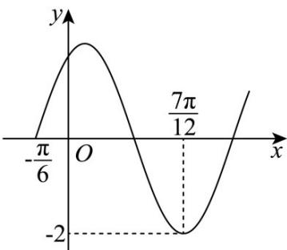

> [!faq]- 《专题5.4.2正弦函数、余弦函数的性质（高效培优讲义）数学人教A版2019高一必修第一册》官方解析
>
> > [!success]- **【答案】**  A. $\omega = 2$ B. $f(x)$ 的图象关于点 $\left(\frac{\pi}{4},0\right)$ 对称 C. $f(x)$ 在 $\left[\frac{\pi}{12},\frac{\pi}{2}\right]$ 上单调递减 D．把 $f(x)$ 的图像向左平移 $\frac{\pi}{3}$ 个单位，所得图像对应的函数为偶函数
>
> > [!note]- **【解析】**
> > 由图象可得 A = 2 ，设函数 $f(x)$ 的周小正周期为 T ，
> >
> > 由图象可得 $\frac{7\pi}{12}-\left(-\frac{\pi}{6}\right)=\frac{3\pi}{4}=\frac{3T}{4}$ ，所以 $T=\pi$ ，
> >
> > 由 $T=\frac{2\pi}{\omega}=\pi(\omega>0)\Rightarrow\omega=2$
> >
> > 故 $^{A}$ 选项正确；
> >
> > 因为 $f(-\frac{\pi}{6}) = 2\cos \left[2\times \left(-\frac{\pi}{6}\right) + \varphi \right] = 0$
> >
> > 所以 $-\frac{\pi}{3} + \varphi = \frac{\pi}{2} + k\pi (k \in \mathbb{Z})$ ，即 $\varphi = \frac{5\pi}{6} + k\pi (k \in \mathbb{Z})$
> >
> > 又 $|\varphi| < \frac{\pi}{2}$ ，所以当 $k = -1 \Rightarrow \varphi = -\frac{\pi}{6}$ ，
> >
> > 所以函数 $f(x)=2\cos(2x-\frac{\pi}{6})$ ，
> >
> > 令 $2x - \frac{\pi}{6} = \frac{\pi}{2} + k\pi (k \in \mathbb{Z})$ ，即 $x = \frac{\pi}{3} + \frac{k\pi}{2} (k \in \mathbb{Z})$
> >
> > 令 $\frac{\pi}{3} +\frac{k\pi}{2} = \frac{\pi}{4}\Rightarrow k = -\frac{1}{6}\notin \mathbf{Z}$
> >
> > 故函数 $f(x)$ 的图象不关于点 $\left(\frac{\pi}{4},0\right)$ 对称，故B选项不正确；
> >
> > 因为 $\frac{\pi}{12} \leq x \leq \frac{\pi}{2}$ ，所以 $0 \leq 2x - \frac{\pi}{6} \leq \frac{5\pi}{6}$ ，
> >
> > 由 $y = \cos t$ 在 $\left[0, \frac{5\pi}{6}\right]$ 单调递减，所以 $C$ 选项正确；
> >
> > $f(x)$ 的图像向左平移 $\frac{\pi}{3}$ 个单位后得到：
> >
> > $$
> > g (x) = 2 \cos \left[ 2 \left(x + \frac {\pi}{3}\right) - \frac {\pi}{6} \right] = 2 \cos \left(2 x + \frac {\pi}{2}\right) = - 2 \sin 2 x
> > $$
> >
> > 由 $g(x)$ 的定义域为 R 关于原点对称，
> >
> > 且 $g(-x) = -2\sin (-2x) = -g(x)$
> >
> > 所以 $f(x)$ 的图像向左平移 $\frac{\pi}{3}$ 个单位后得到的函数为奇函数，
> >
> > 故 $^{D}$ 选项不正确；
> >
> > 故选 **AC**.
