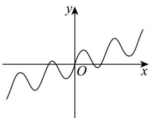
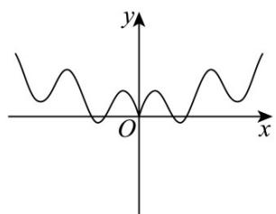
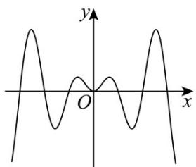
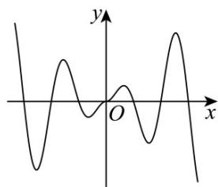

> [!faq]- 《专题5.4.2正弦函数、余弦函数的性质（高效培优讲义）数学人教A版2019高一必修第一册》官方解析
>
> > [!success]- **【答案】** A. $0 < \omega \leq \frac{1}{3}$ B. $0 < \omega \leq \frac{1}{4}$ C. $0 < \omega \leq \frac{1}{6}$ D. $0 < \omega \leq \frac{1}{2}$
>
> > [!note]- **【解析】**
> > 由题意可得 $\left\{\begin{aligned}-\frac{\pi}{2}+k\pi&\leq-\frac{\pi}{2}\cdot\omega-\frac{\pi}{3}\\ \frac{\pi}{2}\cdot\omega-\frac{\pi}{3}&\leq\frac{\pi}{2}+k\pi\end{aligned}\right.$ ， $k\in Z$ 解得 $\omega \leq \frac{1}{3} - 2k$ 且 $\omega \leq \frac{5}{3} + 2k$ ， $k \in Z$ ，
> > 又，则 $\left\{\begin{aligned}\frac{1}{3}-2k>0\\ \frac{5}{3}+2k>0\end{aligned}\right.$ ，则， $\omega > 0$ $k \in Z$ $k = 0$ 故 $\omega \leq \frac{1}{3}$ $\omega \leq \frac{5}{3}$ $0 < \omega \leq \frac{1}{3}$ .
> >
> > 故选：A.
> >
> > 9. 函数 $f(x) = |x| \cdot \sin x$ 的图象大致为（）
> >
> > 【答案】
> >
> > A
> >
> > 
> >
> > B
> >
> > 
> >
> > C
> >
> > 
> >
> > D
> >
> > 
> >
> > 【答案】D
> >
> > 【详解】函数 $f(x)=|x|\cdot\sin x$ 的定义域为 R，
> >
> > $f(-x)=|-x|\cdot\sin(-x)=-|x|\sin x=-f(x)$ ，即函数 $f(x)$ 为奇函数，排除 BC 选项，
> >
> > 由 $f(x) = 0$ 可得 $x = 0$ 或 $\sin x = 0$ ，解得 $\{x|x = k\pi ,k\in \mathbf{Z}\}$
> >
> > 故函数 $f(x)$ 有无数个零点，排除 A 选项.
> >
> > 故选：D.
> >
> > 10. 函数 $f(x) = \sin (\omega x + \frac{\pi}{6})(\omega > 0)$ 在 $[0, \pi]$ 上有且仅有 $^{3}$ 个零点和 $^{2}$ 个最小值点，则 $\omega$ 的取值范围为（）A. $[\frac{17}{6}, \frac{10}{3})$ B. $[\frac{10}{3}, \frac{23}{6})$ C. $[\frac{17}{6}, \frac{10}{3}]$ D. $(\frac{10}{3}, \frac{23}{6})$
> >
> > 【答案】B
> >
> > <!-- source-part:2 pages:51-61 -->
> >
> > 【详解】当时， $\omega x + \frac{\pi}{6} \in [\frac{\pi}{6}, \omega \pi + \frac{\pi}{6}]$ ，依题意， $\left\{\begin{aligned}&3\pi \leq \omega \pi + \frac{\pi}{6} < 4\pi \\&\frac{7\pi}{2} \leq \omega \pi + \frac{\pi}{6} < \frac{11\pi}{2}\end{aligned}\right.$ ，解得 $\frac{10}{3} \leq \omega < \frac{23}{6}$ ，所以 $\omega$ 的取值范围为 $\left[\frac{10}{3}, \frac{23}{6}\right)$ 。
> >
> > 故选 **B**
