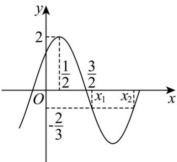

> [!faq]- 《专题5.4.2正弦函数、余弦函数的性质（高效培优讲义）数学人教A版2019高一必修第一册》官方解析
>
> > [!success]- **【答案】**  A. $\omega = \frac{\pi}{2}$ B．若函数 $y = f(ax)(a > 0)$ 在 $[0,1]$ 上单调递增，则 $0 < a \leq \frac{1}{2}$ C. $f(x)$ 的图象关于点 $(-1,0)$ 中心对称 D．若 $f(x_{1})=f(x_{2})=-\frac{2}{3}$ ，则 $\cos\left[\frac{\pi}{4}(x_{2}-x_{1})\right]=\frac{1}{3}$
>
> > [!note]- **【解析】**
> > 对于 $^{A}$ ，由图可知函数 $f(x)$ 的最小正周期 $T=4\times\left(\frac{3}{2}-\frac{1}{2}\right)=4$ ，则 $\frac{2\pi}{\omega}=4$ ，解得 $\omega=\frac{\pi}{2}$ ，故 $^{A}$ 正确；对于 $^{B}$ ，由 $0\leq x\leq1$ ，则 $\frac{\pi}{4}\leq\frac{a\pi}{2}x+\frac{\pi}{4}\leq\frac{(2a+1)\pi}{4}$ ，
> >
> > 由正弦函数的单调性，则 $0 \leq \frac{\pi}{4} < \frac{(2a + 1)\pi}{4} \leq \frac{\pi}{2}$ ，解得 $0 < a \leq \frac{1}{2}$ ，故 B 正确；
> >
> > 对于 C，令 $\frac{\pi}{2}x + \frac{\pi}{4} = k\pi(k \in \mathbb{Z})$ ，解得 $x = -\frac{1}{2} + 2k(k \in \mathbb{Z})$ ，显然 $-\frac{1}{2} + 2k \neq -1$ ，故 C 错误；
> >
> > 对于D，由题意可得 $x_{1} + x_{2} = 2\times \frac{5}{2} = 5$ ，即 $x_{1} = 5 - x_{2}$
> >
> > 则 $\cos \left[\frac{\pi}{4}\left(x_2 - x_1\right)\right] = \cos \left(\frac{\pi}{2} x_2 - \frac{5\pi}{4}\right) = \cos \left(\frac{\pi}{2} x_2 + \frac{\pi}{4} - \frac{3\pi}{2}\right) = -\sin \left(\frac{\pi}{2} x_2 + \frac{\pi}{4}\right) = \frac{1}{3}$ ，故D正确.
> >
> > 故选 **ABD**.
