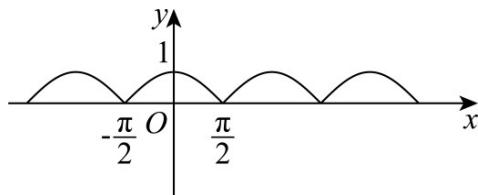
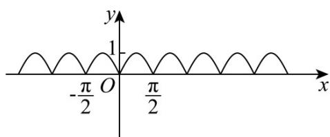

> [!faq]- 《专题5.4.2正弦函数、余弦函数的性质（高效培优讲义）数学人教A版2019高一必修第一册》官方解析
>
> > [!success]- **【答案】** A
>
> > [!note]- **【解析】**
> > 对于 $\mathbb{A}$ ，易知 $f(x) = |\cos x|$ 满足 $f(-x) = |\cos (-x)| = |\cos x| = f(x)$ ，为偶函数，
> >
> > 画出函数图象如下图所示：
> >
> > 
> >
> > 最小正周期为 $\pi$ ，满足题意，即 $A^{A}$ 正确；
> >
> > 对于 B，易知 $f(x)=\cos\left(2x+\frac{\pi}{2}\right)=-\sin2x$ 为奇函数，因此 B 错误；
> >
> > 对于 C，易知 $f(x)=\sin(2x+\pi)=-\sin2x$ 为奇函数，可知 C 错误；
> >
> > 对于 D，易知 $f(x)=\left|\sin2x\right|$ 满足 $f(-x)=\left|\sin(-2x)\right|=\left|-\sin2x\right|=\left|\sin2x\right|=f(x)$ 为偶函数，
> >
> > 其图象如下图所示：
> >
> > 
> >
> > 显然其最小正周期为 $\frac{\pi}{2}$ ，不合题意，即 $^D$ 错误·
> >
> > 故选 **A**
