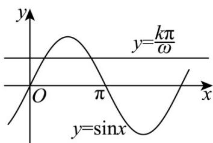

> [!faq]- 《专题5.4.2正弦函数、余弦函数的性质（高效培优讲义）数学人教A版2019高一必修第一册》官方解析
>
> > [!success]- **【答案】** A
>
> > [!note]- **【解析】**
> > 由题意知，曲线 $y=\sin x$ 与直线 $y=\frac{k\pi}{\omega}(k\in\mathbb{N}^{*})$ 在区间 $(0,\pi)$ 内共有 2025 个交点，
> >
> > 由曲线 $y = \sin x$ 在区间 $(0, \pi)$ 内的图象，
> >
> > 可得当 $k=1,2,\cdots,1012$ 时，方程 $\sin x=\frac{k\pi}{\omega}$ 分别有两个不同的实根，且各根均不同，
> >
> > 要使得 $\sin x = \frac{k\pi}{\omega} (k \in \mathbb{N}^{*})$ 在区间 $(0, \pi)$ 内共有 2025 个交点，则满足 $\frac{1013\pi}{\omega} = 1$
> >
> > 解得 $\omega = 1013\pi$
> >
> > 故选：A.
> >
> > 
> >
> > ## 方法技巧
> >
> > 一般函数的值域求法有：观察法、配方法、判别式法、反比例函数法等。
> >
> > 三角函数是函数的特殊形式，一般方法也适用，但要结合三角函数本身的性质。
> >
> > 常见的三角函数求值域或最值的类型有以下几种：
> >
> > （1）形如 $y = A\sin (\omega x + \varphi)$ 的三角函数，令 $t = \omega x + \varphi$ ，根据题中 $x$ 的取值范围，求出 $t$ 的取值范围，再利用三角函数的单调性、有界性求出 $y = \sin t$ 的最值（值域）。
> >
> > （2）形如 $y = a\sin^2 x + b\sin x + c (a \neq 0)$ 的三角函数，可先设 $t = \sin x$ ，将函数 $y = a\sin^2 x + b\sin x + c (a \neq 0)$ 化为关于 $t$ 的二次函数 $y = at^2 + bt + c (a \neq 0)$ ，根据二次函数的单调性求值域（最值）。
> >
> > (3) 对于形如 $y = a \sin x$ (或 $y = a \cos x$ ) 的函数的最值还要注意对 $a$ 的讨论.
