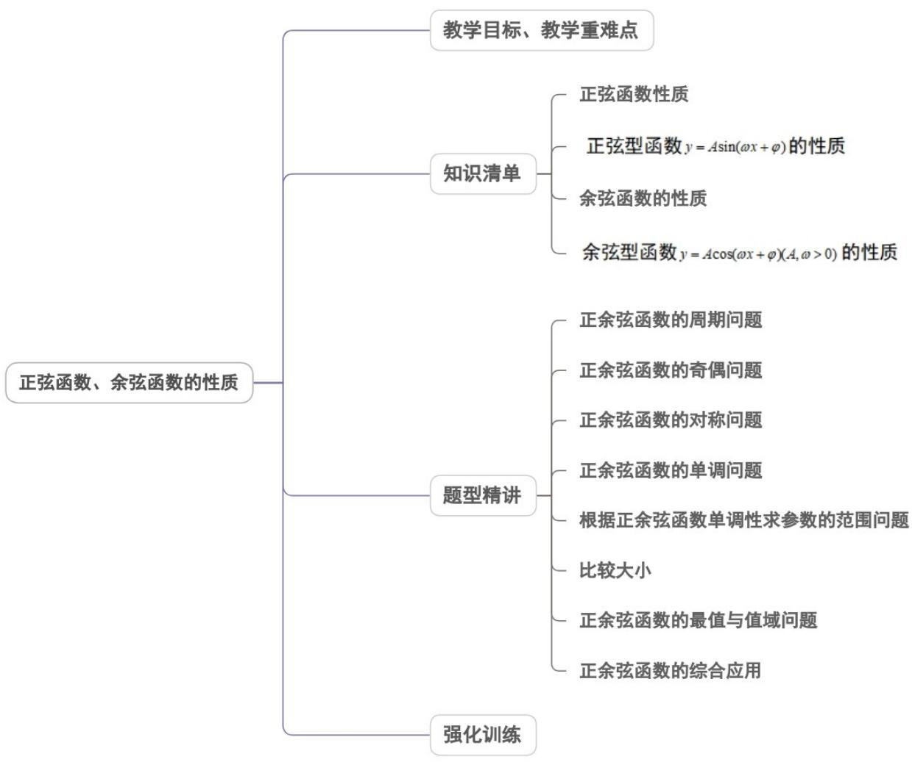
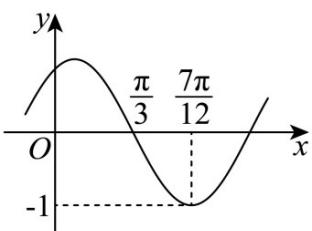

<!-- source-part:1 pages:1-50 -->

## 专题5.4.2 正弦函数、余弦函数的性质

## 内容概览

## 教学目标、教学重难点

<table><tr><td>教学目标</td><td>1.结合正弦函数、余弦函数的图象掌握正、余弦函数的性质。2.会求正、余弦函数的周期,单调区间、对称点、对称轴及最值,及结合函数的图象会求函数的解析式,并能求出相关的基本量。</td></tr><tr><td>教学重难点</td><td>1.重点:会求正、余弦函数的最小正周期,单调区间,对称点,对称区间,会求两类函数的最值。</td></tr></table>

<table><tr><td></td><td>2.难点:掌握正余弦的综合问题。</td></tr></table>

## 知识清单

## 知识点 01 正弦函数性质

<table><tr><td>函数</td><td>正弦函数 $y = \sin x$ </td></tr><tr><td>定义域</td><td> $R$ </td></tr><tr><td>值域</td><td> $[-1,1]$ </td></tr><tr><td>奇偶性</td><td>奇函数</td></tr><tr><td>周期性</td><td>最小正周期 $2\pi$ </td></tr><tr><td>单调区间 $(k \in Z)$ </td><td> $[2k\pi - \frac{\pi}{2} 2k\pi + \frac{\pi}{2}]$ 减区间 $[2k\pi + \frac{\pi}{2} 2k\pi + \frac{3\pi}{2}]$ </td></tr><tr><td>最值点 $(k \in Z)$ </td><td>最大值点 $(2k\pi + \frac{\pi}{2}, 1)$ ;最小值点 $(2k\pi - \frac{\pi}{2}, -1)$ </td></tr><tr><td>对称中心 $(k \in Z)$ </td><td> $(k\pi, 0)$ </td></tr><tr><td>对称轴 $(k \in Z)$ </td><td> $x = k\pi + \frac{\pi}{2}$ </td></tr></table>

【即学即练】

1. 已知函数 $f\left(2x + \frac{\pi}{3}\right) = 2\cos (x + \varphi)$ ，若函数 $f(x)$ 为奇函数，且函数 $f(x)$ 在区间 $[-m, m]$ 上单调，则实数 $m$

的取值范围为（ ）A. $(0,\pi ]$ B. $\left(0,\frac{3\pi}{4}\right]$ C. $\left(0,\frac{\pi}{2}\right]$ D. $\left(0,\frac{\pi}{4}\right]$

【答案】A

【详解】令 $t = 2x + \frac{\pi}{3}$ ，则 $x = \frac{1}{2} t - \frac{\pi}{6}$ ，故 $f(t) = 2\cos \left(\frac{1}{2} t - \frac{\pi}{6} +\varphi\right)$

故 $f(x) = 2\cos \left(\frac{1}{2} x - \frac{\pi}{6} +\varphi\right)$

又由函数 $f(x)$ 的图象关于原点对称，得 $\varphi -\frac{\pi}{6} = k\pi +\frac{\pi}{2}\bigl (k\in \mathbb{Z}\bigr)$ ，解得 $\varphi = k\pi +\frac{2\pi}{3}\bigl (k\in \mathbb{Z}\bigr)$

则 $f(x)=2\cos\left(\frac{1}{2}x-\frac{\pi}{6}+k\pi+\frac{2\pi}{3}\right)=$

$2\cos \left(\frac{1}{2} x + k\pi +\frac{\pi}{2}\right) = -2\sin \left(\frac{1}{2} x + k\pi\right) = \pm 2\sin \frac{1}{2} x$

当 $x \in [-m, m]$ 时， $\frac{x}{2} \in \left[-\frac{m}{2}, \frac{m}{2}\right]$ ，若函数 $f(x)$ 在区间 $[-m, m]$ 上单调，

则 $-\frac{\pi}{2} \leq -\frac{m}{2} < \frac{m}{2} \leq \frac{\pi}{2}$ ，则 $0 < m \leq \pi$ 。

故选：A.

2. 若函数 $f(x) = \sin \omega x (\omega > 0)$ 在区间 $\left[\frac{\pi}{6}, \frac{2\pi}{3}\right]$ 上单调递增，且 $f(x) = 1$ 在区间 $[0, \pi]$ 上有唯一的实数解，则 $\omega$

的取值范围是（ ）A. $\left[\frac{1}{3},\frac{3}{4}\right)$ B. $\left(0,\frac{3}{4}\right]$ C. $\left[\frac{1}{2},\frac{3}{4}\right]$ D. $\left[\frac{1}{2},\frac{3}{4}\right)$

【答案】C

【详解】由函数 $f(x) = \sin \omega x(\omega >0)$ ，令 $-\frac{\pi}{2} + 2k\pi \leq \omega x \leq \frac{\pi}{2} + 2k\pi, k \in \mathbb{Z}$

解得 $-\frac{\pi}{2\omega} + \frac{2k\pi}{\omega} \leq x \leq \frac{\pi}{2\omega} + \frac{2k\pi}{\omega}, k \in \mathbb{Z}$

即函数 $f(x)$ 的递增区间为 $\left[-\frac{\pi}{2\omega} +\frac{2k\pi}{\omega},\frac{\pi}{2\omega} +\frac{2k\pi}{\omega}\right],k\in Z$

因为函数 $f(x) = \sin \omega x (\omega > 0)$ 在区间 $\left[\frac{\pi}{6}, \frac{2\pi}{3}\right]$ 上单调递增，

可得 $\left[\frac{\pi}{6},\frac{2\pi}{3}\right]\subset \left[-\frac{\pi}{2\omega} +\frac{2k\pi}{\omega},\frac{\pi}{2\omega} +\frac{2k\pi}{\omega}\right],k\in \mathbb{Z}$

则满足 $\left\{ \begin{array}{ll} - \frac{\pi}{2\omega} +\frac{2k\pi}{\omega}\leq \frac{\pi}{6}\\  \frac{\pi}{2\omega} +\frac{2k\pi}{\omega}\quad \frac{2\pi}{3} \end{array} \right.,k\in \mathbb{Z}$ 且，解得 $12k - 3\leq \omega \leq 3k + \frac{3}{4},k\in \mathbb{Z}$ 且，

由 $x \in [0, \pi]$ ，可得 $\omega x \in [0, \omega \pi]$

因为 $f(x) = 1$ 在区间 $[0, \pi]$ 上有唯一的实数解，可得 $\frac{\pi}{2} \leq \omega \pi < \frac{5\pi}{2}$ ，解得 $\frac{1}{2} \leq \omega < \frac{5}{2}$ ，

综上可得，当 $k = 0$ 时， $\frac{1}{2} \leq \omega \leq \frac{3}{4}$ ，所以 $\omega$ 的取值范围为 $[\frac{1}{2}, \frac{3}{4}]$ 。

故选：C.

## 知识点 02 正弦型函数 $y = A \sin(\omega x + \varphi)$ 的性质

函数 $y = A\sin (\omega x + \varphi)$ 与函数 $y = A\cos (\omega x + \varphi)$ 可看作是由正弦函数 $y = \sin x$ ，余弦函数 $y = \cos x$ 复合而成的

复合函数，因此它们的性质可由正弦函数 $y = \sin x$ ，余弦函数 $y = \cos x$ 类似地得到：

(1) 定义域：R

(2) 值域： $\left[-A, A\right]$

（3）单调区间：求形如 $y = A\sin (\omega x + \varphi)$ 的函数的单调区间可以通过解不等式的方法去解答，即把 $\omega x + \varphi$ 视

为一个“整体”，分别与正弦函数 $y = \sin x$ 的单调递增（减）区间对应解出 $x$ ，即为所求的单调递增（减）区间。

比如：由 $2k\pi - \frac{\pi}{2} \leq \omega x + \phi \leq 2k\pi + \frac{\pi}{2} (k \in Z)$ 解出 $x$ 的范围所得区间即为增区间，由

$2k\pi + \frac{\pi}{2} \leq \omega x + \phi \leq 2k\pi + \frac{3\pi}{2} (k \in Z)$ 解出 $x$ 的范围，所得区间即为减区间。

（4）奇偶性：正弦型函数 $y = A\sin (\omega x + \varphi)$ 不一定具备奇偶性．对于函数 $y = A\sin (\omega x + \varphi)$ ，当 $\varphi = k\pi (k\in Z)$ 时为奇函数，当 $\varphi = k\pi \pm \frac{\pi}{2} (k\in Z)$ 时为偶函数．

【即学即练】

1. 已知函数 $f(x) = \sin (2x + \varphi)\left(\left|\varphi\right| < \frac{\pi}{2}\right)$ 在区间 $\left(0, \frac{\pi}{6}\right)$ 上单调，则 $\varphi$ 的取值范围（）A. $\left(-\frac{\pi}{2}, \frac{\pi}{3}\right]$ B. $\left(-\frac{\pi}{2}, \frac{\pi}{6}\right]$ C. $\left[-\frac{\pi}{3}, \frac{\pi}{3}\right]$ D. $\left[-\frac{\pi}{6}, \frac{\pi}{6}\right]$

【答案】B

【详解】因为 $x \in \left(0, \frac{\pi}{6}\right)$ ，所以 $\varphi < 2x + \varphi < \varphi + \frac{\pi}{3}$

因为 $y = \sin x$ 在 $\left[-\frac{\pi}{2} + 2k\pi, \frac{\pi}{2} + 2k\pi\right], k \in \mathbb{Z}$ 上单调递增，在 $\left[\frac{\pi}{2} + 2k\pi, \frac{3\pi}{2} + 2k\pi\right], k \in \mathbb{Z}$ 上单调递减，且 $|\varphi| < \frac{\pi}{2}$

所以当 $-\frac{\pi}{2} < \varphi, \varphi + \frac{\pi}{3} \leq \frac{\pi}{2}$ 时，即 $-\frac{\pi}{2} < \varphi \leq \frac{\pi}{6}$ 时，函数 $f(x)$ 在 $\left(0, \frac{\pi}{6}\right)$ 上单调递增，

则 $\varphi$ 的取值范围 $\left(-\frac{\pi}{2},\frac{\pi}{6}\right]$

故选：B.

2. 若函数 $f(x) = \sin \omega x (\omega < 0)$ 在 $\left[-\frac{\pi}{6}, \frac{\pi}{6}\right]$ 上单调递减，在 $\left[\frac{\pi}{6}, \frac{\pi}{2}\right]$ 上单调递增，则 $\omega = (\quad)$ A. -4 B. -3 C. -2 D. -1

【答案】B

【详解】由题意，函数 $f(x)$ 的图象经过原点，且在 $\left[-\frac{\pi}{6},\frac{\pi}{6}\right]$ 上单调递减，在 $\left[\frac{\pi}{6},\frac{\pi}{2}\right]$ 上单调递增，
所以 $\frac{T}{4}=\frac{\pi}{6}-0=\frac{\pi}{6}$ ，即 $T=\frac{2\pi}{3}$ 又 $T=\frac{2\pi}{|\omega|}=\frac{2\pi}{3}$ ， $\omega<0$ ，解得 $\omega=-3$

故选：B.

## 知识点 03 余弦函数的性质

<table><tr><td>函数</td><td>余弦函数 $y = \cos x$ </td></tr><tr><td>定义域</td><td> $R$ </td></tr><tr><td>值域</td><td> $[-1,1]$ </td></tr><tr><td>奇偶性</td><td>偶函数</td></tr><tr><td>周期性</td><td>最小正周期 $2\pi$ </td></tr><tr><td>单调区间 $(k \in Z)$ </td><td>增区间 $[2k\pi - \pi 2k\pi]$ 减区间 $[2k\pi, 2k\pi + \pi]$ </td></tr><tr><td>最值点 $(k \in Z)$ </td><td>最大值点 $(2k\pi, 1)$ 最小值点 $(2k\pi + \pi, -1)$ </td></tr><tr><td>对称中心 $(k \in Z)$ </td><td> $(k\pi + \frac{\pi}{2}, 0)$ </td></tr><tr><td>对称轴 $(k \in Z)$ </td><td> $x = k\pi$ </td></tr></table>

## 【即学即练】

1. 已知函数 $f(x) = \cos (2x + \varphi)\left(|\varphi| < \frac{\pi}{2}\right)$ ，且对任意 $x \in \mathbb{R}$ ，都有 $f(x) \leq f\left(\frac{5\pi}{6}\right)$ 恒成立，若函数 $y = f(x)$ 在 $[0, a]_{\text{单调递减，则}}^{a} \text{的最大值是（）}$ A. $\frac{\pi}{6}$ B. $\frac{\pi}{3}$ C. $\frac{2\pi}{3}$ D. $\frac{5\pi}{6}$

【答案】B

【详解】由条件可知， $f\left(\frac{5\pi}{6}\right)=\cos\left(\frac{5\pi}{3}+\varphi\right)=1$ ，则 $\frac{5\pi}{3}+\varphi=2k\pi, k\in Z$ 且 $\left|\varphi\right|<\frac{\pi}{2}$ ，所以 $\varphi=\frac{\pi}{3}$ 所以 $f(x)=\cos\left(2x+\frac{\pi}{3}\right)$ 当 $x\in[0,a]$ ，则 $2x+\frac{\pi}{3}\in\left[\frac{\pi}{3},2a+\frac{\pi}{3}\right]$ 若函数 $y = f(x)$ 在 $[0, a]$ 单调递减，则 $\frac{\pi}{3} < 2a + \frac{\pi}{3} \leq \pi$ ，得 $0 < a \leq \frac{\pi}{3}$ ，
所以 a 的最大值为 $\frac{\pi}{3}$ .

故选：B

2. 函数 $f(x)=\cos\left(\omega x+\frac{\pi}{4}\right)(\omega>0)$ 在 $(0,\pi)$ 上单调递减，则 $\omega$ 的最大值为（） A. $\frac{1}{4}$ B. $\frac{3}{4}$ C. $\frac{1}{2}$ D. 1

【答案】B

【详解】令 $2k\pi \leq \omega x + \frac{\pi}{4} \leq \pi + 2k\pi, k \in \mathbb{Z}$ ，故 $\frac{2k\pi}{\omega} - \frac{\pi}{4\omega} \leq x \leq \frac{3\pi}{4\omega} + \frac{2k\pi}{\omega}, k \in \mathbb{Z}$

所以函数 $f(x)$ 的减区间为 $\frac{2k\pi}{\omega} -\frac{\pi}{4\omega}\leq x\leq \frac{3\pi}{4\omega} +\frac{2k\pi}{\omega},k\in Z$

因为 $f(x)$ 在 $(0, \pi)$ 上为减函数，

故存在 $k \in Z$ ，使得 $\frac{2k\pi}{\omega} - \frac{\pi}{4\omega} \leq 0 < x < \pi \leq \frac{3\pi}{4\omega} + \frac{2k\pi}{\omega}$ ，因为 $\omega > 0$ ，

所以 $k = 0$ ，所以 $-\frac{\pi}{4\omega} \leq 0 < x < \pi \leq \frac{3\pi}{4\omega}$ ，故 $0 < \omega \leq \frac{3}{4}$

则 $\omega$ 的最大值为 $\frac{3}{4}$ .

故选：B.

## 知识点 04 余弦型函数 $y = A \cos(\omega x + \varphi) (A, \omega > 0)$ 的性质

函数 $y = A\cos (\omega x + \varphi)$ 可看作是由余弦函数 $y = \cos x$ 复合而成的复合函数，因此它们的性质可由余弦函数

$y = \cos x$ 类似地得到：

(1) 定义域：R

(2) 值域： $\left[-A, A\right]$

(3) 单调区间：求形如 $y = A\cos (\omega x + \varphi)(A, \omega > 0)$ 的函数的单调区间可以通过解不等式的方法去解答，即把

$\omega x + \varphi$ 视为一个“整体”，余弦函数 $y = \cos x$ 的单调递增（减）区间对应解出 $x$ ，即为所求的单调递增（减）

区间.

（4）奇偶性：余弦型函数 $y = A\cos (\omega x + \varphi)(A,\omega >0)$ 不一定具备奇偶性，对于函数 $y = A\cos (\omega x + \varphi)$ ，当

$\varphi = k\pi (k\in Z)$ 时为偶函数，当 $\varphi = k\pi \pm \frac{\pi}{2} (k\in Z)$ 时为奇函数.

（5）周期：函数 $y = A\cos (\omega x + \varphi)$ 的周期与解析式中自变量 $x$ 的系数有关，其周期为 $T = \frac{2\pi}{\omega}$

（6）对称轴和对称中心：与正弦函数 $y = \sin x$ 比较可知，当 $\omega x + \varphi = k\pi \pm \frac{\pi}{2} (k \in Z)$ 时，函数

$y = A\sin (\omega x + \varphi)$ 取得最大值（或最小值），因此函数 $y = A\sin (\omega x + \varphi)$ 的对称轴由 $\omega x + \varphi = k\pi \pm \frac{\pi}{2} (k\in Z)$ 解

出，其对称中心的横坐标 $\omega x + \varphi = k\pi (k\in Z)$ ，即对称中心为 $\left(\frac{k\pi - \varphi}{\omega},0\right)(k\in Z)$ .同理， $y = A\cos (\omega x + \varphi)$ 的

对称轴由 $\omega x + \varphi = k\pi (k\in Z)$ 解出，对称中心的横坐标由 $\omega x + \varphi = k\pi \pm \frac{\pi}{2} (k\in Z)$ 解出.

【即学即练】

1. 下列四个函数中，以 $\pi$ 为最小正周期，且在区间 $\left(\frac{\pi}{2},\pi\right)$ 上单调递减的是（）A. $y = |\sin x|$ B. $y = \cos (x + \pi)$ C. $y = \sin 2(x + \pi)$ D. $y = \sin \left(2x + \frac{\pi}{2}\right)$

【答案】D

【详解】由于 $y = \sin x$ 在区间 $\left(\frac{\pi}{2},\pi\right)$ 上单调递减，此时 $y = |\sin x| = \sin x$ 在区间 $\left(\frac{\pi}{2},\pi\right)$ 上单调递减，且最小正

周期为 $\pi$ ，故 A 正确；

因为 $y = \cos(x + \pi) = \cos x$ ，最小正周期为 $2\pi$ ，故 B 错误；

由于 $y = \sin 2(x + \pi) = \sin 2x$ ，当 $x\in \left(\frac{\pi}{2},\pi\right)$ 时， $2x\in (\pi ,2\pi)$ ，此时 $y = \sin 2x$ 不是单调函数，故C错误；

对于 $\mathsf{D}$ ， $y = \sin \left(2x + \frac{\pi}{2}\right) = \cos 2x$ ，当 $x\in \left(\frac{\pi}{2},\pi\right)$ 时， $2x\in (\pi ,2\pi)$ ，此时 $y = \cos 2x$ 是单调递增函数，故 $\mathsf{D}$ 错误

故选：A.

2．函数 $f(x) = A\cos (\omega x + \varphi)$ 的图象如图所示，其中 $A > 0, \omega > 0$ ， $|\varphi| < \frac{\pi}{2}$ ，则 $f\left(\frac{8\pi}{3}\right) =$ （）

【答案】

A. $\frac{1}{2}$ B. $-\frac{1}{2}$ C. $\frac{\sqrt{3}}{2}$ D. $-\frac{\sqrt{3}}{2}$

【答案】D

【详解】由题图， $A = 1$ 且 $\frac{T}{4} = \frac{2\pi}{4\omega} = \frac{7\pi}{12} -\frac{\pi}{3} = \frac{\pi}{4}$ ，则 $\omega = 2$ ，故 $f(x) = \cos (2x + \varphi)$

由 $f\left(\frac{7\pi}{12}\right) = \cos \left(2\times \frac{7\pi}{12} +\varphi\right) = -1$ ，则 $\frac{7\pi}{6} +\varphi = \pi +2k\pi ,k\in Z$ ，又 $|\varphi | <   \frac{\pi}{2}$ ，则 $\varphi = -\frac{\pi}{6}$

所以 $f(x) = \cos \left(2x - \frac{\pi}{6}\right)$ ，则 $f\left(\frac{8\pi}{3}\right) = \cos \left(2\times \frac{8\pi}{3} -\frac{\pi}{6}\right) = \cos \left(5\pi +\frac{\pi}{3} -\frac{\pi}{6}\right) = -\cos \frac{\pi}{6} = -\frac{\sqrt{3}}{2}.$

## 题型精讲

![[高中/课堂同步/题库/人教A版高中数学同步讲义(2026)/01_必修第一册/第五章 三角函数/专题5.4.2正弦函数、余弦函数的性质（高效培优讲义）数学人教A版2019高一必修第一册（解析版）/题型01_正余弦函数的周期问题/题型01_正余弦函数的周期问题.md]]
![[高中/课堂同步/题库/人教A版高中数学同步讲义(2026)/01_必修第一册/第五章 三角函数/专题5.4.2正弦函数、余弦函数的性质（高效培优讲义）数学人教A版2019高一必修第一册（解析版）/题型02_正余弦函数的奇偶问题/题型02_正余弦函数的奇偶问题.md]]
![[高中/课堂同步/题库/人教A版高中数学同步讲义(2026)/01_必修第一册/第五章 三角函数/专题5.4.2正弦函数、余弦函数的性质（高效培优讲义）数学人教A版2019高一必修第一册（解析版）/题型03_正余弦函数的对称问题/题型03_正余弦函数的对称问题.md]]
![[高中/课堂同步/题库/人教A版高中数学同步讲义(2026)/01_必修第一册/第五章 三角函数/专题5.4.2正弦函数、余弦函数的性质（高效培优讲义）数学人教A版2019高一必修第一册（解析版）/题型04_正余弦函数的单调问题/题型04_正余弦函数的单调问题.md]]
![[高中/课堂同步/题库/人教A版高中数学同步讲义(2026)/01_必修第一册/第五章 三角函数/专题5.4.2正弦函数、余弦函数的性质（高效培优讲义）数学人教A版2019高一必修第一册（解析版）/题型05_根据正余弦函数单调性求参数的范围问题/题型05_根据正余弦函数单调性求参数的范围问题.md]]
![[高中/课堂同步/题库/人教A版高中数学同步讲义(2026)/01_必修第一册/第五章 三角函数/专题5.4.2正弦函数、余弦函数的性质（高效培优讲义）数学人教A版2019高一必修第一册（解析版）/题型07_正余弦函数的最值与值域问题/题型07_正余弦函数的最值与值域问题.md]]
![[高中/课堂同步/题库/人教A版高中数学同步讲义(2026)/01_必修第一册/第五章 三角函数/专题5.4.2正弦函数、余弦函数的性质（高效培优讲义）数学人教A版2019高一必修第一册（解析版）/题型08_正余弦函数的综合应用/题型08_正余弦函数的综合应用.md]]
![[高中/课堂同步/题库/人教A版高中数学同步讲义(2026)/01_必修第一册/第五章 三角函数/专题5.4.2正弦函数、余弦函数的性质（高效培优讲义）数学人教A版2019高一必修第一册（解析版）/强化训练/强化训练.md]]
