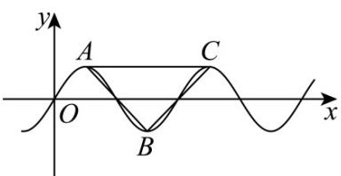

> [!faq]- 《专题5.4.2正弦函数、余弦函数的性质（高效培优讲义）数学人教A版2019高一必修第一册（解析版）》官方解析
>
> > [!success]- **【答案】** D
>
> > [!note]- **【解析】**
> > 由题意作图如下：
> >
> > 
> >
> > 由 $y = \frac{1}{2}\sin \omega x$ ，则令 $\omega x = \frac{\pi}{2} +k\pi (k\in \mathbb{Z})$ ，解得 $x = \frac{\pi}{2\omega} +\frac{k\pi}{\omega}\big(k\in \mathbb{Z}\big)$
> >
> > 可得 $A\left(\frac{\pi}{2\omega}, \frac{1}{2}\right)$ ， $B\left(\frac{\pi}{2\omega} + \frac{\pi}{\omega}, -\frac{1}{2}\right)$ ， $C\left(\frac{\pi}{2\omega} + \frac{2\pi}{\omega} \cdot \frac{1}{2}\right)$
> >
> > 由题意可得 $\frac{\pi}{2\omega} +\frac{2\pi}{\omega} <  \pi \leq \frac{\pi}{2\omega} +\frac{3\pi}{\omega}$ ，解得 $\frac{5}{2} <  \omega \leq \frac{7}{2}$
> >
> > 易知 $\vee ABC$ 为等腰三角形， $AB = BC$ ，底 $AC = \frac{2\pi}{\omega}$ ，其上的高为1，
> >
> > 由题意可得 $\frac{1}{2} AC < 1$ ，则 $\frac{\pi}{\omega} < 1$ ，解得 $\pi < \omega$ ，
> >
> > 所以 $\pi < \omega \leq \frac{7}{2}$ .
> >
> > 故选：
