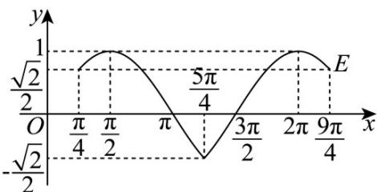

> [!faq]- 《专题5.4.2正弦函数、余弦函数的性质（高效培优讲义）数学人教A版2019高一必修第一册（解析版）》官方解析
>
> > [!success]- **【答案】** $(2)(3)$
>
> > [!note]- **【解析】**
> > 由解析式易得 $f(x) = \left\{ \begin{array}{l} \sin x, \frac{\pi}{4} + 2k\pi \leq x \leq \frac{5\pi}{4} + 2k\pi \\ \cos x, \frac{5\pi}{4} + 2k\pi \leq x \leq \frac{9\pi}{4} + 2k\pi \end{array} , k \in \mathbb{Z}\right.$ ，函数部分大致图象如下，
> >
> > 
> >
> > 由图知，值域为 $\left[-\frac{\sqrt{2}}{2},1\right]$ 且最小正周期为 $2\pi$ ，所以（1）错，（2）对，
> >
> > 当 $x = k\pi + \frac{\pi}{4}, k \in \mathbb{Z}$ 时， $f^2(x) + f^2(\pi + x) = \sin^2(k\pi + \frac{\pi}{4}) + \sin^2(\pi + k\pi + \frac{\pi}{4}) = 1$
> >
> > 当 $x\in \left(2k\pi +\frac{\pi}{4},2k\pi +\frac{5\pi}{4}\right),k\in \mathbb{Z}$ 时， $f^2 (x) + f^2 (\pi +x) = \sin^2 x + \cos^2 (x + \pi) = \sin^2 x + \cos^2 x = 1$
> >
> > 当 $x\in \left(2k\pi +\frac{5\pi}{4},2k\pi +\frac{9\pi}{4}\right),k\in \mathbb{Z}$ 时， $f^{2}(x) + f^{2}(\pi +x) = \cos^{2}x + \sin^{2}(x + \pi) = \cos^{2}x + \sin^{2}x = 1$
> >
> > 所以对任意 $x \in \mathrm{R}, f^{2}(x) + f^{2}(\pi + x) = 1$ 恒成立，(3) 对·
> >
> > 故答案为： $(2)(3)$
