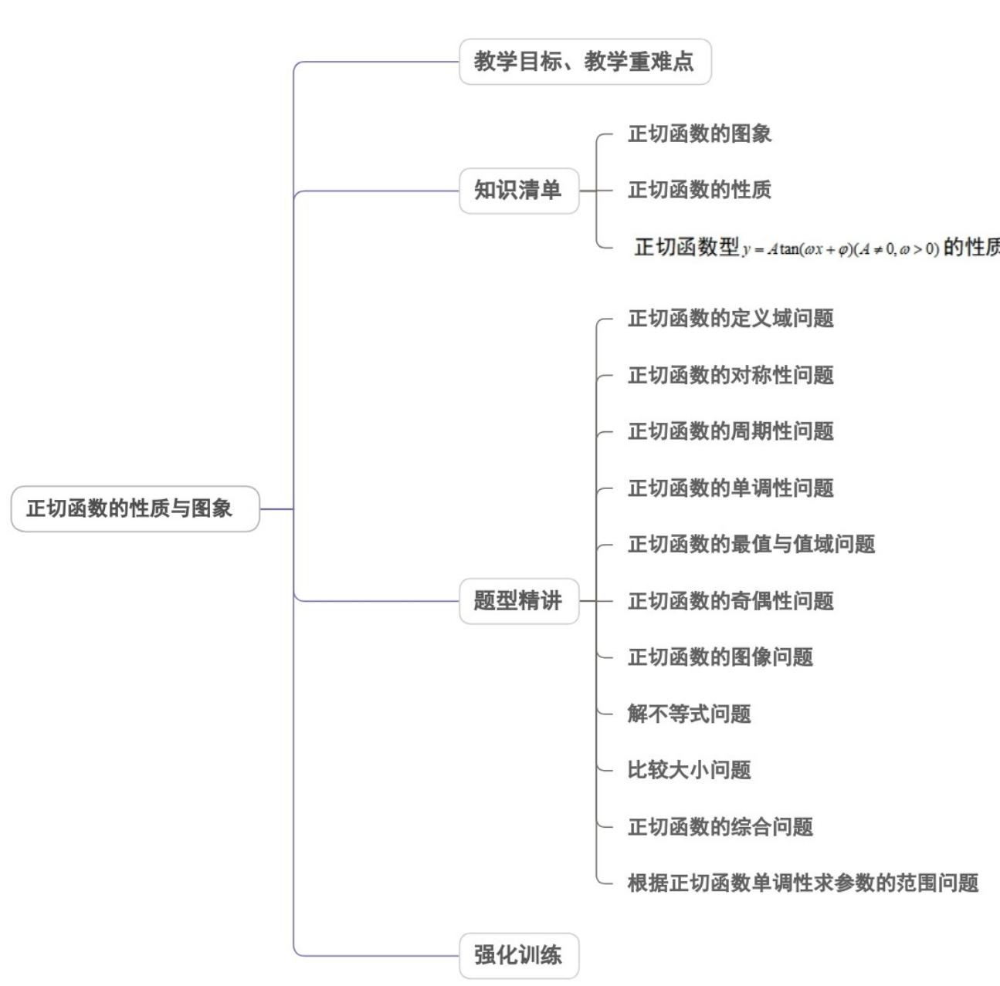
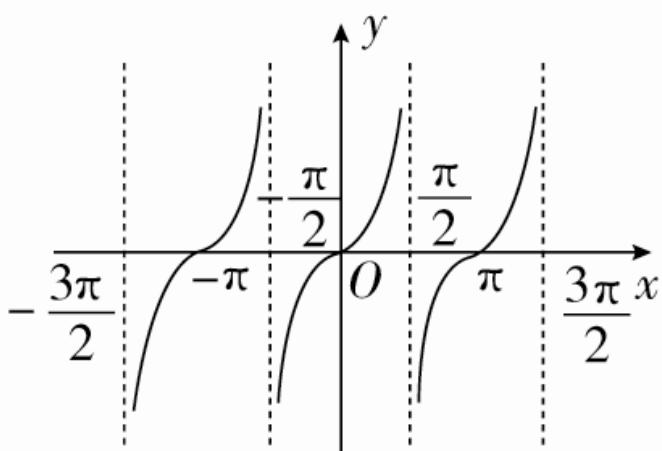
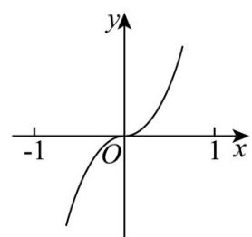
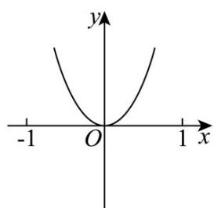
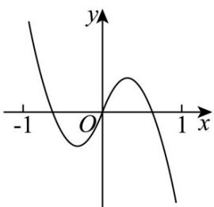
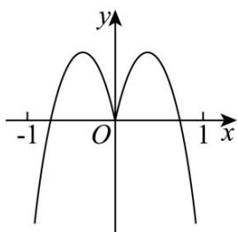
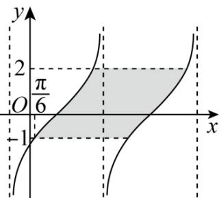
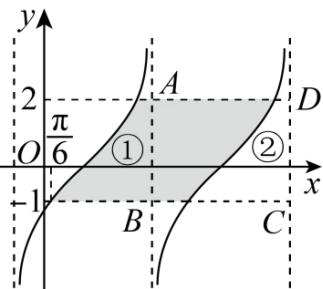

<!-- source-part:1 pages:1-50 -->

专题5.4.3 正切函数的性质与图像

教学目标、教学重难点

<table><tr><td>教学目标</td><td>1.理解与掌握正切函数的性质,并能运用正切函数的性质解决与正切函数相关的周期性、奇偶性,定义域、值域、单调性等问题。2.掌握正切函数的图象的画法,会运用正切函数的图象研究正切函数的性质,并能解决与正切函数有关的相关量问题。</td></tr><tr><td>教学重难点</td><td>1.重点:会运用正切函数的图象与性质解决与正切函数有关的周期、奇偶性、单调性及值域等问题。2.难点:掌握正切函数的综合问题。</td></tr></table>

## 知识清单

## 知识点 01 正切函数的图象

正切函数 $y = \tan x$ ， $x \in R$ 且 $x \neq \frac{\pi}{2} + k\pi$ ， $k \in Z$ 图象：

## 【即学即练】

1. 函数 $f(x) = 2x \cdot \tan x \quad (-1 < x < 1)$ 的图象可能是（）

【答案】

A

B

C

D

【答案】B

【详解】因为函数 $f(x)=2x\cdot\tan x$ （-1<x<1）

所以 $f(-x) = -2x \cdot \tan (-x) = 2x \tan x = f(x)$ ，则函数 $f(x)$ 为偶函数，故排除 A，C 选项；

又 $f(1)=2\times1\times\tan1=2\tan1>0$ ，故排除 D 选项，故选 B 符合.

故选：B.

2. 函数 $f(x) = \tan (\omega x + \varphi) \left( \omega > 0, |\varphi| < \frac{\pi}{2} \right)$ 的图像如图所示，图中阴影部分的面积为 $6\pi$ ，则 $f\left( \frac{2023\pi}{3} \right) =$ （）

【答案】

A. $-\frac{\sqrt{3}}{3}$ B. $-\sqrt{3}$ C. $\frac{\sqrt{3}}{3}$ D. $\sqrt{3}$

【答案】A

【详解】如图，①和②面积相等，故阴影部分的面积即为矩形ABCD的面积，可得AB=3

设函数 $f(x)$ 的最小正周期为 T，则 AD = T，

由题意得 $3T = 6\pi$ ，解得 $T = 2\pi$ ，故 $\frac{\pi}{\omega} = 2\pi$ ，得 $\omega = \frac{1}{2}$ ，即 $f(x) = \tan \left(\frac{1}{2} x + \varphi\right)$

$f(x)$ 的图象过点 $\left(\frac{\pi}{6}, -1\right)$ ，即 $\tan \left(\frac{1}{2} \times \frac{\pi}{6} + \varphi\right) = \tan \left(\frac{\pi}{12} + \varphi\right) = -1$

$\varphi \in \left(-\frac{\pi}{2},\frac{\pi}{2}\right)$ ，则 $\frac{\pi}{12} +\varphi \in \left(-\frac{5\pi}{12},\frac{7\pi}{12}\right)$

$\therefore \frac{\pi}{12} + \varphi = -\frac{\pi}{4}$ ，解得 $\varphi = -\frac{\pi}{3}$

$$
f (x) = \tan \left(\frac {1}{2} x - \frac {\pi}{3}\right)
$$

$$
\therefore f \left(\frac {2 0 2 3 \pi}{3}\right) = \tan \left(\frac {2 0 2 3 \pi}{6} - \frac {\pi}{3}\right) = \tan \frac {2 0 2 1 \pi}{6} = \tan \frac {5 \pi}{6} = - \frac {\sqrt {3}}{3}.
$$

故选：A

## 知识点 02 正切函数的性质

1、定义域： $\left\{x\mid x\neq\frac{\pi}{2}+k\pi,k\in Z\right\}$

2、值域： $R$

由正切函数的图象可知，当 $x < \frac{\pi}{2} + k\pi (k\in Z)$ 且无限接近于 $\frac{\pi}{2} +k\pi$ 时， $\tan x$ 无限增大，记作 $\tan x\to +\infty$ （$\tan x$ 趋向于正无穷大）；当 $x > -\frac{\pi}{2} + k\pi (k \in Z)$ ， $\tan x$ 无限减小，记作 $\tan x \to -\infty$ （ $\tan x$ 趋向于负无穷大）也可以从单位圆上的正切线来考虑。因此 $\tan x$ 可以取任何实数值，但没有最大值和最小值。称直线 $x = k\pi + \frac{\pi}{2}$ ， $k \in Z$ 为正切函数的渐进线。

3、周期性：周期函数，最小正周期是 $\pi$

4、奇偶性：奇函数，即 $\tan (-x) = -\tan x$

5、单调性：在开区间 $\left(-\frac{\pi}{2} + k\pi, \frac{\pi}{2} + k\pi\right)$ ， $k \in Z$ 内，函数单调递增

【即学即练】

1. 若对 $\forall x \in \left[-\frac{\pi}{3}, \frac{\pi}{2}\right)$ ，关于 $x$ 的不等式 $\tan x - a$ 恒成立，则实数 $a$ 的取值范围为（）A. $\left[-\sqrt{3}, +\infty\right)$ B. $(\sqrt{3}, +\infty)$ C. $(- \infty, \sqrt{3})$ D. $(- \infty, -\sqrt{3}]$

【答案】D

【详解】由题意 $\left(\tan x\right)_{\min}$ $a, x \in \left[-\frac{\pi}{3}, \frac{\pi}{2}\right)$ 即可，所以 $a \leq \tan\left(-\frac{\pi}{3}\right) = -\sqrt{3}$

故选：D.

2. 已知函数 $f(x)=\tan\left(\omega x+\frac{\pi}{4}\right)\left(\omega>0\right)$ 的最小正周期为 $2\pi$ ，则不等式 $f(x)>\frac{\sqrt{3}}{3}$ 的解集为（）A. $\left(2k\pi-\frac{\pi}{6},2k\pi+\frac{\pi}{2}\right),k\in\mathbf{Z}$ B. $\left(4k\pi-\frac{\pi}{6},4k\pi+\frac{\pi}{2}\right),k\in\mathbf{Z}$

C. $\left(2k\pi -\frac{\pi}{6}, + \infty\right),k\in \mathbf{Z}$ D. $\left(4k\pi -\frac{\pi}{6}, + \infty\right),k\in \mathbf{Z}$

【答案】A

【详解】因为函数 $f(x) = \tan \left(\omega x + \frac{\pi}{4}\right)$ 的最小正周期为 $2\pi$ ，所以 $\frac{\pi}{\omega} = 2\pi$ ，得

所以 $f(x)=\tan\left(\frac{1}{2}x+\frac{\pi}{4}\right)$

由 $\tan \left(\frac{1}{2} x + \frac{\pi}{4}\right) > \frac{\sqrt{3}}{3}$ ，得 $k\pi + \frac{\pi}{6} < \frac{1}{2} x + \frac{\pi}{4} < k\pi + \frac{\pi}{2}, k \in \mathbf{Z}$

解得 $2k\pi - \frac{\pi}{6} < x < 2k\pi + \frac{\pi}{2}, k \in \mathbf{Z}$

故选：A.

## 知识点 03 正切函数型 $y = A \tan(\omega x + \varphi) (A \neq 0, \omega > 0)$ 的性质

1、定义域：将“ $\omega x + \varphi$ ”视为一个“整体”。令 $\omega x + \varphi \neq k\pi + \frac{\pi}{2}, k \in Z$ 解得 $x$ 。

2、值域： $(-\infty , + \infty)$

3、单调区间：

(1) 把“ $\omega x + \varphi$ ”视为一个“整体”；

(2) $A > 0 (A < 0)$ 时，函数单调性与 $y = \tan x (x \neq k\pi + \frac{\pi}{2}, k \in Z)$ 的相同（反）；

(3) 解不等式，得出 $x$ 范围。

$$
T = \frac {\pi}{| \omega |}
$$

4、周期：

【即学即练】

1. 已知函数 $f(x)=\tan\left(2x-\frac{\pi}{3}\right)$ ，下列说法正确的是（）

【答案】

A. 函数 $f(x)$ 最小正周期为 $\pi$ B. 定义域为 $\left\{x \mid x \in R, x \neq \frac{k\pi}{2} + \frac{\pi}{12}, k \in Z\right\}$ C. 函数 $f(x)$ 图象所有对称中心为 $\left(\frac{k\pi}{2} + \frac{\pi}{6}, 0\right)$ ， $k \in Z$ D. 函数 $f(x)$ 的单调递增区间为 $\left(\frac{k\pi}{2} - \frac{\pi}{12}, \frac{k\pi}{2} + \frac{5\pi}{12}\right)$ ， $k \in Z$

【答案】D

【详解】对于A，由 $f(x)=\tan\left(2x-\frac{\pi}{3}\right)$ 可得 $\omega=2$ ，所以函数 $f(x)$ 最小正周期为 $\frac{\pi}{\omega}=\frac{\pi}{2}$ ，即A错误；
对于B，由正切函数定义域可得 $2x-\frac{\pi}{3}\neq\frac{\pi}{2}+k\pi,k\in\mathbb{Z}$ ，解得 $x\neq\frac{k\pi}{2}+\frac{5\pi}{12},k\in\mathbb{Z}$ ；
可得 $f(x)$ 的定义域为 $\left\{x\mid x\in\mathbb{R},x\neq\frac{k\pi}{2}+\frac{5\pi}{12},k\in\mathbb{Z}\right\}$ ，即B错误；
对于C，利用对称中心方程可得 $2x-\frac{\pi}{3}=\frac{k\pi}{2},k\in\mathbb{Z}$ ，解得 $x=\frac{k\pi}{4}+\frac{\pi}{6},k\in\mathbb{Z}$ 因此函数 $f(x)$ 图象所有对称中心为 $\left(\frac{k\pi}{4}+\frac{\pi}{6},0\right),k\in\mathbb{Z}$ ，可知C错误；
对于D，根据正切函数单调性可得 $-\frac{\pi}{2}+k\pi<2x-\frac{\pi}{3}<\frac{\pi}{2}+k\pi,k\in\mathbb{Z}$ 解得 $-\frac{\pi}{12}+\frac{k\pi}{2}<x<\frac{5\pi}{12}+\frac{k\pi}{2},k\in\mathbb{Z}$

所以函数 $f(x)$ 的单调递增区间为 $\left(\frac{k\pi}{2} -\frac{\pi}{12},\frac{k\pi}{2} +\frac{5\pi}{12}\right)$ ，可得D正确·故选：D
2.已知函数 $f(x) = \tan (2x - \frac{\pi}{6})$ ，则（ ）A. $f(x)$ 的最小正周期是 $\pi$ B. $f(x)$ 的定义域是 $\{x\mid x\neq k\pi +\frac{\pi}{3},k\in \mathbb{Z}\}$ C. $f(x)$ 在区间 $(0,\frac{\pi}{2})$ 上单调递增D.不等式 $f(x)$ 1的解集是 $\left[\frac{k\pi}{2} +\frac{5\pi}{24},\frac{k\pi}{2} +\frac{\pi}{3}\right),k\in \mathbf{Z}$

【答案】D

【详解】对于 $^{A}$ ，函数 $f(x)=\tan(2x-\frac{\pi}{6})$ 的最小正周期是 $\frac{\pi}{2}$ ， $^{A}$ 错误；

对于 $^{B}$ ，由 $2x-\frac{\pi}{6}\neq k\pi+\frac{\pi}{2},k\in Z$ ，得 $x\neq\frac{k\pi}{2}+\frac{\pi}{3},k\in Z$

所以函数定义域为 $\{x \mid x \neq \frac{k\pi}{2} + \frac{\pi}{3}, k \in Z\}$ ，B 错误；

对于 $C$ ，当 $x = \frac{\pi}{3}$ 时， $2\times \frac{\pi}{3} -\frac{\pi}{6} = \frac{\pi}{2}$ 函数 $f(x)$ 无意义，又 $\frac{\pi}{3}\in (0,\frac{\pi}{2})$ ，则 $f(x)$ 在 $(0,\frac{\pi}{2})$ 上不单调递增， $C$ 错误；对于 $D$ ，不等式 $f(x)\quad 1\Leftrightarrow \tan (2x - \frac{\pi}{6})\quad 1$ ，则 $k\pi +\frac{\pi}{4}\leq 2x - \frac{\pi}{6} < k\pi +\frac{\pi}{2},k\in Z$

解得 $\frac{k\pi}{2} +\frac{5\pi}{24}\leq x <   \frac{k\pi}{2} +\frac{\pi}{3},k\in \mathbb{Z}$

所以不等式 $f(x)$ 1的解集是 $\left[\frac{k\pi}{2} +\frac{5\pi}{24},\frac{k\pi}{2} +\frac{\pi}{3}\right),k\in \mathbb{Z}$ ，D正确·

故选：D

## 题型精讲

![[高中/课堂同步/题库/人教A版高中数学同步讲义(2026)/01_必修第一册/第五章 三角函数/专题5.4.3正切函数的性质与图像（高效培优讲义）数学人教A版2019高一必修第一册/题型01_正切函数的定义域问题/题型01_正切函数的定义域问题.md]]
![[高中/课堂同步/题库/人教A版高中数学同步讲义(2026)/01_必修第一册/第五章 三角函数/专题5.4.3正切函数的性质与图像（高效培优讲义）数学人教A版2019高一必修第一册/题型02_正切函数的对称性问题/题型02_正切函数的对称性问题.md]]
![[高中/课堂同步/题库/人教A版高中数学同步讲义(2026)/01_必修第一册/第五章 三角函数/专题5.4.3正切函数的性质与图像（高效培优讲义）数学人教A版2019高一必修第一册/题型03_正切函数的周期性问题/题型03_正切函数的周期性问题.md]]
![[高中/课堂同步/题库/人教A版高中数学同步讲义(2026)/01_必修第一册/第五章 三角函数/专题5.4.3正切函数的性质与图像（高效培优讲义）数学人教A版2019高一必修第一册/题型04_正切函数的单调性问题/题型04_正切函数的单调性问题.md]]
![[高中/课堂同步/题库/人教A版高中数学同步讲义(2026)/01_必修第一册/第五章 三角函数/专题5.4.3正切函数的性质与图像（高效培优讲义）数学人教A版2019高一必修第一册/题型05_正切函数的最值与值域问题/题型05_正切函数的最值与值域问题.md]]
![[高中/课堂同步/题库/人教A版高中数学同步讲义(2026)/01_必修第一册/第五章 三角函数/专题5.4.3正切函数的性质与图像（高效培优讲义）数学人教A版2019高一必修第一册/题型06_正切函数的奇偶性问题/题型06_正切函数的奇偶性问题.md]]
![[高中/课堂同步/题库/人教A版高中数学同步讲义(2026)/01_必修第一册/第五章 三角函数/专题5.4.3正切函数的性质与图像（高效培优讲义）数学人教A版2019高一必修第一册/题型07_正切函数的图像问题/题型07_正切函数的图像问题.md]]
![[高中/课堂同步/题库/人教A版高中数学同步讲义(2026)/01_必修第一册/第五章 三角函数/专题5.4.3正切函数的性质与图像（高效培优讲义）数学人教A版2019高一必修第一册/题型08_解不等式问题/题型08_解不等式问题.md]]
![[高中/课堂同步/题库/人教A版高中数学同步讲义(2026)/01_必修第一册/第五章 三角函数/专题5.4.3正切函数的性质与图像（高效培优讲义）数学人教A版2019高一必修第一册/题型09_比较大小问题/题型09_比较大小问题.md]]
![[高中/课堂同步/题库/人教A版高中数学同步讲义(2026)/01_必修第一册/第五章 三角函数/专题5.4.3正切函数的性质与图像（高效培优讲义）数学人教A版2019高一必修第一册/题型10_正切函数的综合问题/题型10_正切函数的综合问题.md]]
![[高中/课堂同步/题库/人教A版高中数学同步讲义(2026)/01_必修第一册/第五章 三角函数/专题5.4.3正切函数的性质与图像（高效培优讲义）数学人教A版2019高一必修第一册/题型11_根据正切函数单调性求参数的范围问题/题型11_根据正切函数单调性求参数的范围问题.md]]
![[高中/课堂同步/题库/人教A版高中数学同步讲义(2026)/01_必修第一册/第五章 三角函数/专题5.4.3正切函数的性质与图像（高效培优讲义）数学人教A版2019高一必修第一册/强化训练/强化训练.md]]
