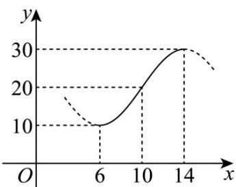

<!-- question-source:start -->
7. 如图，某地一天从 $^{6}$ 至 $^{14}$ 时的温度变化曲线近似满足函数： $y = A\sin \left( \omega x + \frac{3\pi}{4} \right) + 20$ ，则这天 $^{12}$ 时的气温

约是（）

A. $25^{\circ}\mathrm{C}$ B. $26^{\circ}\mathrm{C}$ C. $27^{\circ}\mathrm{C}$ D. $28^{\circ}\mathrm{C}$
<!-- question-source:end -->

![[高中/课堂同步/题库/人教A版高中数学同步讲义(2026)/01_必修第一册/第五章 三角函数/专题5.4.3正切函数的性质与图像（高效培优讲义）数学人教A版2019高一必修第一册/强化训练/questions/answers/Q00076415A1.md]]
