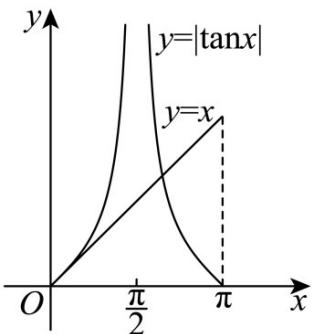
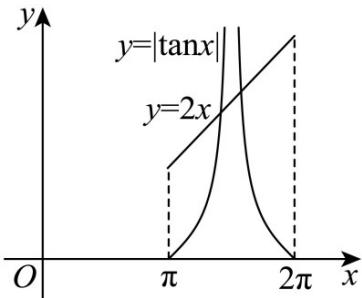

> [!faq]- 《专题5.4.3正切函数的性质与图像（高效培优讲义）数学人教A版2019高一必修第一册》官方解析
>
> > [!success]- **【答案】** C
>
> > [!note]- **【解析】**
> > 因为点 $P(1,1)$ 在函数 $f(x) = \left(a + \left[\frac{x}{\pi}\right]\right)x$ 图象上，所以 $f(1) = a + \left[\frac{1}{\pi}\right] = a + 0 = 1$ ，所以 $a = 1$ ， $f(x) = \left(1 + \left[\frac{x}{\pi}\right]\right)x$
> >
> > 函数 $g(x) = f(x) - |\tan x|$ 零点的个数转化为方程 $f(x) = |\tan x|$ 即 $\left(1 + \left[\frac{x}{\pi}\right]\right)x = \tan x$ 的解的个数，也可转化为函数 $f(x) = \left(1 + \left[\frac{x}{\pi}\right]\right)x$ 的图象与函数 $y = |\tan x|$ 图象交点的个数，因为 $\left[\frac{x}{\pi}\right]$ 的取值会改变 $f(x)$ 的表达式，所以需要分类讨论，
> > （1）当 $0 \leq x < \pi$ 且 $x \neq \frac{\pi}{2}$ 时， $0 \leq \frac{x}{\pi} < 1$ ， $\left[\frac{x}{\pi}\right] = 0$ ， $f(x) = x$ ，当 $0 \leq x < \frac{\pi}{2}$ 时， $|\tan x| = \tan x$ ，当 $\frac{\pi}{2} < x < \pi$ 时， $|\tan x| = -\tan x$ ，
> >
> > 
> >
> > 由图可知， $f(x)=x$ 与 $y=\left|\tan x\right|$ 图象有2个交点；
> >
> > (2) 当 $\pi \leq x < 2\pi$ 且 $x \neq \frac{3\pi}{2}$ 时， $1 \leq \frac{x}{\pi} < 2$ ， $\left[\frac{x}{\pi}\right] = 1$ ， $f(x) = 2x$
> >
> > 当 $\pi \leq x < \frac{3\pi}{2}$ 时， $|\tan x| = \tan x$ ，当 $\frac{3\pi}{2} < x < 2\pi$ 时， $|\tan x| = -\tan x$ ，
> >
> > 
> >
> > 由图可知， $f(x)=2x$ 与 $y=\left|\tan x\right|$ 图象有 2 个交点；
> >
> > 综上，零点个数为 $2 + 2 = 4$ 个·
> >
> > 故选 **C**.
