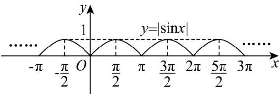

> [!faq]- 《专题5.4.3正切函数的性质与图像（高效培优讲义）数学人教A版2019高一必修第一册》官方解析
>
> > [!success]- **【答案】** C
>
> > [!note]- **【解析】**
> > 对于 A， $y = \cos x$ 的最小正周期为 $2\pi$ ，不合题意，故 A 错误；
> >
> > 对于 B， $y = \sin 2x$ 是奇函数，不合题意，故 B 错误；
> >
> > 对于 $C$ ，作出函数 $y = |\sin x|$ 的图象如下图所示：
> >
> > 
> >
> > 由图可知，函数 $y = \left| \sin x \right|$ 是最小正周期为 $\pi$ 的偶函数，故 C 正确；
> >
> > 对于D，设 $f(x) = \tan |x|$ ，因为 $f\left(-\frac{\pi}{4}\right) = \tan \left| -\frac{\pi}{4} \right| = \tan \frac{\pi}{4} = 1$
> >
> > $f\left(\frac{3\pi}{4}\right) = \tan \left|\frac{3\pi}{4}\right| = \tan \frac{3\pi}{4} = -1$ ，所以 $f\left(-\frac{\pi}{4}\right)\neq f\left(\frac{3\pi}{4}\right)$
> >
> > 所以 $f(x)=\tan|x|$ 的周期不是 $\pi$ ，故 D 错误.
> >
> > 故选 **C**.
