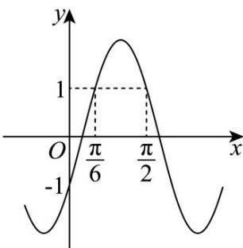

> [!faq]- 《专题5.4.3正切函数的性质与图像（高效培优讲义）数学人教A版2019高一必修第一册》官方解析
>
> > [!success]- **【答案】** A
>
> > [!note]- **【解析】**
> > ∵ $0 < \sin1 < 1$ ，∴ $\ln(\sin1) < 0$ ；∵ $\tan1 > 0$ ，∴ $e^{\tan1} > 1$ ；
> >
> > 又∵ $0 < \cos1 < 1$ ，所以，b > c > a
> >
> > 故选:A.
> >
> > 4. 函数 $f(x) = 2\sin (\omega x + \varphi)$ （ $\omega > 0$ ， $|\varphi| < \frac{\pi}{2}$ ）的部分图象如图所示，则（）
> >
> > 【答案】
> >
> > 
> >
> > A. $\omega = 2$ ， $\varphi = -\frac{\pi}{6}$ B. $\omega = 2$ ， $\varphi = \frac{\pi}{6}$ C. $\omega = \frac{1}{2}$ ， $\varphi = -\frac{\pi}{6}$ D. $\omega = \frac{1}{2}$ ， $\varphi = \frac{\pi}{6}$
> >
> > 【答案】A
> >
> > 【详解】由图可知当 $x = 0$ 时， $f(0) = 2\sin \varphi = -1$ ，又 $\left|\varphi\right| < \frac{\pi}{2}$ ，解得 $\varphi = -\frac{\pi}{6}$
> >
> > 又由图可知 $f\left(\frac{\pi}{6}\right) = f\left(\frac{\pi}{2}\right)$ ，所以 $x = \frac{\frac{\pi}{6} + \frac{\pi}{2}}{2} = \frac{\pi}{3}$ 为 $f(x)$ 的对称轴，
> >
> > 则 $\frac{\pi}{3}\omega -\frac{\pi}{6} = \frac{\pi}{2} +2k\pi$ ， $k\in \mathbf{Z}$ ，结合图象 $\frac{\pi}{2} -\frac{\pi}{6} <  \frac{2\pi}{\omega}\times \frac{1}{2}$ ，即 $0 <   \omega <  3$
> >
> > 则解得 $\omega = 2$ ，故A正确·
> >
> > 故选 **A**.
