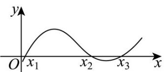

> [!faq]- 《专题5.4.3正切函数的性质与图像（高效培优讲义）数学人教A版2019高一必修第一册》官方解析
>
> > [!success]- **【答案】**  A. 1 B. $\sqrt{3}$ C. $\frac{1}{2}$ D. $\frac{\sqrt{3}}{2}$
>
> > [!note]- **【解析】**
> > 令 $t=\omega x+\varphi$ ，则 $t_{1}+5t_{3}=6t_{2}$ ，∴ $5(t_{3}-t_{2})=t_{2}-t_{1}$
> >
> > $$
> > \because t _ {3} - t _ {1} = 2 \pi \quad \therefore t _ {3} - t _ {1} = (t _ {3} - t _ {2}) + (t _ {2} - t _ {1}) = 2 \pi
> > $$
> >
> > $$
> > \therefore 6 \left(t _ {3} - t _ {2}\right) = 2 \pi , \therefore t _ {3} - t _ {2} = \frac {\pi}{3}
> > $$
> >
> > 又∵ $\frac{t_{3}+t_{2}}{2}=\frac{3\pi}{2}+2k\pi$ ， $k\in\mathbb{Z}$ ，∴ $t_{3}=\frac{5\pi}{3}+2k\pi$ ， $k\in\mathbb{Z}$ ，
> >
> > $\therefore 2\sin t_{3} + b = 2\sin \left(\frac{5\pi}{3}\right) + b = 0$ $\therefore b = \sqrt{3}$
> >
> > 故选 **B**.
