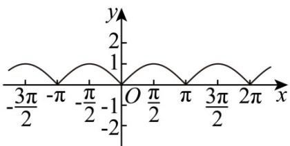

> [!faq]- 《专题5.4.3正切函数的性质与图像（高效培优讲义）数学人教A版2019高一必修第一册》官方解析
>
> > [!success]- **【答案】** A
>
> > [!note]- **【解析】**
> > 对 A： $y=\left|\sin x\right|$ 的图象是由 $y=\sin x$ 的图象将 x 轴下方的图象关于 x 轴对称上去，
> >
> > $x$ 轴及 $x$ 轴上方部分不变所得，其函数图象如下所示：
> >
> > 
> >
> > 则 $y = 2|\sin x|$ 的最小正周期为 $\pi$ ，且在 $\left(\frac{\pi}{2},\pi\right)$ 上单调递减，故 $^{A}$ 正确；
> >
> > 对 B： $y = \cos 2x$ 的最小正周期为 $\frac{2\pi}{2} = \pi$ ，当 $x \in \left(\frac{\pi}{2}, \pi\right)$ 时， $2x \in (\pi, 2\pi)$ ，所以 $y = \cos 2x$ 单调递增，故 B 错误；
> >
> > 对 C : $y = -\tan 2x$ 的最小正周期为 $\frac{\pi}{2}$ ，故 C 错误；
> >
> > 对 D： $y = \cos \frac{x}{2}$ 的最小正周期为 $\frac{2\pi}{\frac{1}{2}} = 4\pi$ ，故 D 错误.
> >
> > 故选 **A**.
