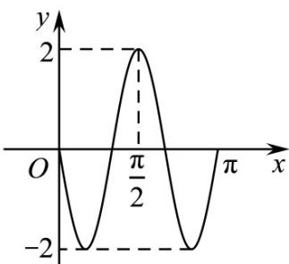

> [!faq]- 《专题5.4.3正切函数的性质与图像（高效培优讲义）数学人教A版2019高一必修第一册》官方解析
>
> > [!success]- **【答案】**  A. $\omega = 3$ B. $\varphi = \frac{\pi}{2}$ C. $f(x)$ 关于点 $\left(\frac{\pi}{6},0\right)$ 对称 D. $f(x)$ 的一条对称轴为直线 $x = \frac{\pi}{3}$
>
> > [!note]- **【解析】**
> > 由题图知：函数 $f(x)$ 的最小正周期 $T = \frac{\pi - \frac{\pi}{2}}{\frac{3}{4}} = \frac{2\pi}{3}$
> >
> > 则 $\omega=\frac{2\pi}{\frac{2\pi}{3}}=3$ ，A=2，所以函数 $f(x)=2\cos(3x+\varphi)$ .
> >
> > 将点 $\left(\frac{\pi}{2}, 2\right)$ 代入解析式中可得 $2 = 2\cos \left(3 \times \frac{\pi}{2} + \varphi\right)$
> >
> > 即 $\sin \varphi = 1$ ，则 $\varphi = 2k\pi +\frac{\pi}{2}\bigl (k\in Z\bigr)$
> >
> > 因为 $0 < \varphi < \pi$ ，所以 $\varphi = \frac{\pi}{2}$ ，故 A，B 正确；
> >
> > $$
> > f (x) = 2 \cos \left(3 x + \frac {\pi}{2}\right) = - 2 \sin 3 x
> > $$
> >
> > $$
> > \therefore f \left(\frac {\pi}{6}\right) = - 2 \sin \left(3 \times \frac {\pi}{6}\right) = - 2 \neq 0
> > $$
> >
> > 所以 $f(x)$ 的图象关于点 $\left(\frac{\pi}{6},0\right)$ 不对称，故 C 不正确；
> >
> > 因为 $f\left(\frac{\pi}{3}\right) = -2\sin \left(3\times \frac{\pi}{3}\right) = 0$
> >
> > 所以直线 $x = \frac{\pi}{3}$ 不是函数 $f(x)$ 图象的一条对称轴，故D不正确；
> >
> > 故选 **AB**.
