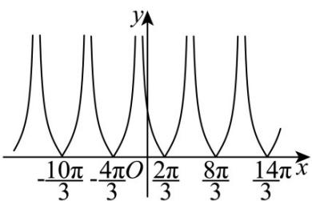

> [!faq]- 《专题5.4.3正切函数的性质与图像（高效培优讲义）数学人教A版2019高一必修第一册》官方解析
>
> > [!success]- **【答案】** (1)定义域为 $\left\{x\mid x\neq\frac{5\pi}{3}+2k\pi,k\in\mathbb{Z}\right\}$ ；值域为 $\left[0,+\infty\right)$ ; (2) $2\pi$ ; 对称轴方程为 $x=\frac{2\pi}{3}+k\pi(k\in\mathbb{Z})$ ; (3)单调减区间为 $\left(-\frac{\pi}{3} + 2k\pi, \frac{2\pi}{3} + 2k\pi\right)(k \in \mathbb{Z})$ ；单调增区间为 $\left[\frac{2\pi}{3} + 2k\pi, \frac{5\pi}{3} + 2k\pi\right)(k \in \mathbb{Z})$
>
> > [!note]- **【解析】**
> > （1）由 $\frac{x}{2} -\frac{\pi}{3}\neq \frac{\pi}{2} +k\pi ,k\in Z$ ，得到 $x\neq \frac{5\pi}{3} +2k\pi ,k\in Z$
> >
> > 又因为 $y = \tan x$ 的值域为 $R$ ，所以 $f(x) = 3\left|\tan \left(\frac{x}{2} - \frac{\pi}{3}\right)\right|$ 的值域为 $[0, +\infty)$ ，
> >
> > 则函数 $f(x)$ 的定义域为 $\left\{x \mid x \neq \frac{5\pi}{3} + 2k\pi, k \in \mathbb{Z}\right\}$ ，值域为 $[0, +\infty)$ .
> >
> > (2) 因为 $y = 3 \tan \left( \frac{x}{2} - \frac{\pi}{3} \right)$ 的周期为 $T = \frac{\pi}{|\omega|} = \frac{\pi}{\frac{1}{2}} = 2\pi$
> >
> > 且 $f(x) = 3\left|\tan \left(\frac{x}{2} -\frac{\pi}{3}\right)\right|$ 的图象可由 $y = 3\tan \left(\frac{x}{2} -\frac{\pi}{3}\right)$ 的图象将 $x$ 轴下方图象关于 $x$ 轴翻折上去，上方图象不变
> >
> > 得到，
> >
> > 又将 $y = \tan x$ 图象上所有点向右平移 $\frac{\pi}{3}$ 个单位，得到 $y = \tan \left(x - \frac{\pi}{3}\right)$
> >
> > 再将 $y = \tan\left(x - \frac{\pi}{3}\right)$ 图象上所有点的横坐标伸长为原来的 2 倍，纵坐标不变得到 $y = \tan\left(\frac{x}{2} - \frac{\pi}{3}\right)$ 的图象，
> >
> > 再将 $y = \tan \left(\frac{x}{2} -\frac{\pi}{3}\right)$ 图象所点的纵坐标伸长到原来的3倍，横坐标不变，得到 $y = 3\tan \left(\frac{x}{2} -\frac{\pi}{3}\right)$
> >
> > 则 $f(x) = 3\left|\tan \left(\frac{x}{2} -\frac{\pi}{3}\right)\right|$ 的图象如图所示，
> >
> > 
> >
> > 由图知 $f(x)=3\left|\tan\left(\frac{x}{2}-\frac{\pi}{3}\right)\right|$ 的周期为 $2\pi$
> >
> > 又由 $\frac{x}{2} -\frac{\pi}{3} = \frac{k\pi}{2},k\in Z$ ，得到 $x = \frac{2\pi}{3} +k\pi ,k\in Z$ ，所以函数 $f(x)$ 的对称轴方程为 $x = \frac{2\pi}{3} +k\pi ,k\in Z$
> >
> > (3) 因为 $y = \tan x$ 在区间 $\left(-\frac{\pi}{2} + k\pi, \frac{\pi}{2} + k\pi\right)(k \in \mathbb{Z})$ 上单调递增，
> >
> > 由 $-\frac{\pi}{2} + k\pi < \frac{x}{2} - \frac{\pi}{3} \leq k\pi, k \in \mathbb{Z}$ ，得到 $-\frac{\pi}{3} + 2k\pi < x \leq \frac{2\pi}{3} + 2k\pi, k \in \mathbb{Z}$
> >
> > 由 $k\pi \leq \frac{x}{2} - \frac{\pi}{3} < \frac{\pi}{2} + k\pi, k \in \mathbb{Z}$ ，得到 $\frac{2\pi}{3} + 2k\pi \leq x < \frac{5\pi}{3} + 2k\pi, k \in \mathbb{Z}$ ，
> >
> > 所以 $f(x)=3\left|\tan\left(\frac{x}{2}-\frac{\pi}{3}\right)\right|$ 的减区间为 $\left(-\frac{\pi}{3}+2k\pi,\frac{2\pi}{3}+2k\pi\right](k\in\mathbb{Z})$ ，增区间为 $\left[\frac{2\pi}{3}+2k\pi,\frac{5\pi}{3}+2k\pi\right)(k\in\mathbb{Z})$ .
