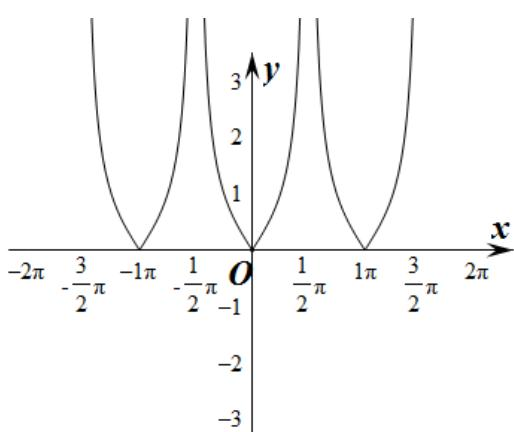

> [!faq]- 《专题5.4.3正切函数的性质与图像（高效培优讲义）数学人教A版2019高一必修第一册》官方解析
>
> > [!success]- **【答案】** D
>
> > [!note]- **【解析】**
> > 
> >
> > 对于 $\mathsf{A}$ 选项， $f\left(-\frac{\pi}{3}\right) = \left|\tan \left(-\frac{\pi}{3}\right)\right| = \sqrt{3}$ ， $f\left(\frac{\pi}{3}\right) = \left|\tan \frac{\pi}{3}\right| = \sqrt{3}$
> >
> > $\therefore f\left(-\frac{\pi}{3}\right)=f\left(\frac{\pi}{3}\right)$ ，故 $^{A}$ 正确；
> >
> > 对于 B 选项，要使 $f(x)=\left|\tan x\right|$ 有意义，则有 $x\neq\frac{\pi}{2}+k\pi,k\in Z$
> >
> > $\therefore f(x)$ 的定义域是 $\left\{x \mid x \neq \frac{\pi}{2} + k\pi, k \in Z\right\}$ ，故 $^B$ 正确；
> >
> > 对于 C 选项， $f(x+3\pi)=\left|\tan(x+3\pi)\right|=\left|\tan x\right|=f(x)$ ，
> >
> > ∴ $3\pi$ 是 $f(x)$ 的一个周期，故 C 正确；
> >
> > 对于 $^{D}$ 选项，如图 $f(x)$ 的图象不关于点 $\left(\frac{\pi}{2},0\right)$ 对称，故 $^{D}$ 错误.
> >
> > 故选：D.
> >
> > ## 方法技巧
> >
> > 求三角函数定义域时，常常归纳为解三角不等式组，这时可利用基本三角函数的图象求得解集。
