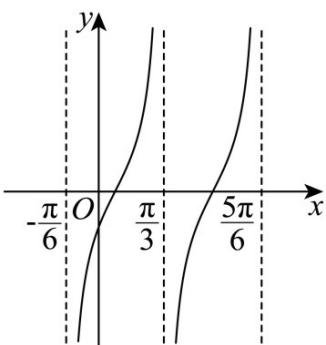

> [!faq]- 《专题5.4.3正切函数的性质与图像（高效培优讲义）数学人教A版2019高一必修第一册》官方解析
>
> > [!success]- **【答案】**  ① $\omega = 2$ ; ② $\varphi = \frac{\pi}{3}$ ; ③ $f(x)$ 的图象与 $y$ 轴的交点坐标为 $\left(0, -\frac{4\sqrt{3}}{3}\right)$ ; ④函数 $y = |f(x)|$ 的图象关于直线 $x = \frac{7\pi}{12}$ 对称 A. 1 B. 2 C. 3 D. 4
>
> > [!note]- **【解析】**
> > 对①，由图可知， $f(x)$ 的最小正周期 $T = \frac{\pi}{\omega} = \frac{\pi}{2}$ ，则 $\omega = 2$ ，故①正确；对②，由图象可知 $x = \frac{\pi}{3}$ 时，函数无意义，故 $\frac{2\pi}{3} - \varphi = \frac{\pi}{2} + k\pi, k \in \mathbf{Z}$
> >
> > 由 $0 < \varphi < \pi$ ，得 $\varphi = \frac{\pi}{6}$ ，即 $f(x) = 4\tan \left(2x - \frac{\pi}{6}\right)$ ，故②错误；
> >
> > 对③，由 $f(0)=-\frac{4\sqrt{3}}{3}$ ，故③正确；
> >
> > 对④，由 $f\left(\frac{7\pi}{12}\right)=4\tan\left(\frac{7\pi}{6}-\frac{\pi}{6}\right)=0$ ，则 $f(x)$ 的图象关于点 $\left(\frac{7\pi}{12},0\right)$ 对称，
> >
> > 由图象对称变换可得函数 $y = |f(x)|$ 的图象关于直线 $x = \frac{7\pi}{12}$ 对称，故④正确.
> >
> > 故选 **C**.
