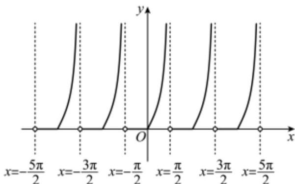

> [!faq]- 《专题5.4.3正切函数的性质与图像（高效培优讲义）数学人教A版2019高一必修第一册》官方解析
>
> > [!success]- **【答案】** D
>
> > [!note]- **【解析】**
> > $f(x) = \tan x + |\tan x| = \left\{ \begin{array}{ll}2\tan x,x\in [k\pi ,\frac{\pi}{2} +k\pi ),k\in Z\\ 0,x\in (-\frac{\pi}{2} +k\pi ,k\pi),k\in Z \end{array} \right.$
> >
> > 作出 $f(x)$ 的图象，如图，观察图象，
> >
> > 
> >
> > 对于 $\mathsf{A}$ ， $f(x)$ 的最小正周期为 $\pi$ ，故 $\mathsf{A}$ 错误；
> >
> > 对于 B， $f(x)$ 的值域为 $[0, +\infty)$ ，B 错误；
> >
> > 对于 C， $f(x)$ 的图象没有对称中心，C 错误；
> >
> > 对于 D，不等式 $f(x) > 2\sqrt{3}$
> >
> > 即 $x \in [k\pi, \frac{\pi}{2} + k\pi) (k \in \mathbb{Z})$ 时 $2\tan x > 2\sqrt{3}$ ，得 $\tan x > \sqrt{3}$ ，
> >
> > 解得 $\frac{\pi}{3} + k\pi < x < \frac{\pi}{2} + k\pi, k \in \mathbb{Z}$
> >
> > 所以 $f(x) > 2\sqrt{3}$ 的解集为 $\left(\frac{\pi}{3} + k\pi, \frac{\pi}{2} + k\pi\right)(k \in \mathbb{Z})$ ，故D正确·
> >
> > 故选 **D**.
