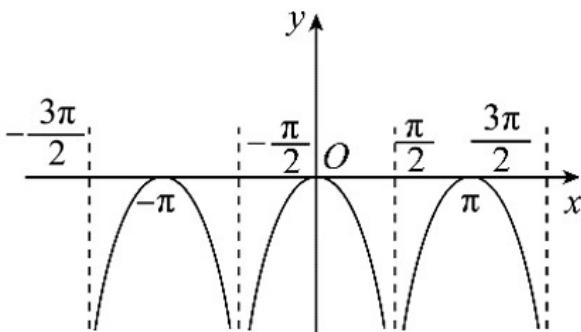

> [!faq]- 《专题5.4.3正切函数的性质与图像（高效培优讲义）数学人教A版2019高一必修第一册》官方解析
>
> > [!success]- **【答案】** D
>
> > [!note]- **【解析】**
> > 对于选项 A，函数 $f(x)$ 的定义域为 $\{x \mid x \neq \frac{\pi}{2} + k\pi, k \in Z\}$ ，故选项 A 错误；
> >
> > 对于选项 B，函数 $f(x)$ 的定义域为 $\{x \mid x \neq \frac{\pi}{2} + k\pi, k \in Z\}$ 关于原点对称，
> >
> > 又 $f(-x) = -|\tan (-x)| = -|\tan x|$ ，则函数 $f(x)$ 为偶函数，故选项B错误；
> >
> > 对于选项 C，根据函数 $f(x)$ 的奇偶性结合正切函数的相关性质，
> >
> > 根据图象变换作出函数 $f(x)$ 草图如下：
> >
> > 
> >
> > 由图可知，函数 $f(x)$ 没有最小值，最大值为 0，故选项 C 错误；
> >
> > 对于选项 D，同样由图可知函数 $f(x)$ 的最小正周期为 $\pi$ ，故选项 D 正确。
> >
> > 故选 **D**.
