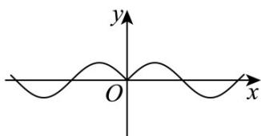

> [!faq]- 《专题5.4.3正切函数的性质与图像（高效培优讲义）数学人教A版2019高一必修第一册》官方解析
>
> > [!success]- **【答案】** B
>
> > [!note]- **【解析】**
> > 选项 A： $y = \tan x$ 是奇函数，不满足题意；
> >
> > 选项 B：令 $y = f(x) = \left|\tan x\right|$ ，定义域为 $\left\{x \mid x \neq \frac{\pi}{2} + k\pi, k \in Z\right\}$ ，关于原点对称，
> > 因为 $f(-x)=\left|\tan(-x)\right|=\left|\tan x\right|=f(x)$ ， $f(x+\pi)=\left|\tan(x+\pi)\right|=\left|\tan x\right|=f(x)$
> >
> > 所以 $y = |\tan x|$ 既是周期函数又是偶函数，满足题意；
> >
> > 选项 C：画出 $y = \sin |x|$ 的图象如图所示，
> >
> > 
> >
> > 则 $y = \sin |x|$ 不是周期函数，不满足题意；
> >
> > 选项D：令 $y = g(x) = \cos \left(\frac{x}{2} +\frac{\pi}{6}\right)$ ，则 $g\left(\frac{2\pi}{3}\right) = \cos \left(\frac{\pi}{3} +\frac{\pi}{6}\right) = 0\neq g\left(-\frac{2\pi}{3}\right) = g\left(-\frac{\pi}{3} +\frac{\pi}{6}\right) = -\frac{\sqrt{3}}{2}$
> >
> > 所以 $y = \cos\left(\frac{x}{2} + \frac{\pi}{6}\right)$ 不是偶函数，不满足题意；
> >
> > 故选：B
> >
> > ## 方法技巧
> >
> > 奇函数，即 $\tan (-x) = -\tan x$
