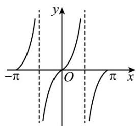
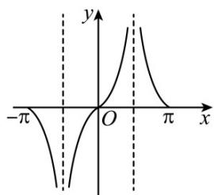
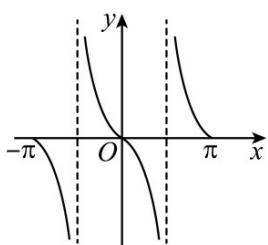
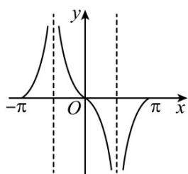

<!-- question-source:start -->
【典例1】函数 $f(x) = \frac{\sin x}{|\cos x|}$ 在区间 $[- \pi, \pi]$ 内的大致图象是（）

A

B

C

D

<!-- question-source:end -->

![[高中/课堂同步/题库/人教A版高中数学同步讲义(2026)/01_必修第一册/第五章 三角函数/专题5.4.3正切函数的性质与图像（高效培优讲义）数学人教A版2019高一必修第一册/题型07_正切函数的图像问题/questions/answers/Q00076390A1.md]]
