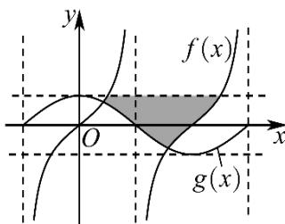

<!-- question-source:start -->
【变式2】已知函数 $f(x) = \tan \omega x (\omega > 0)$ 与函数 $g(x) = \cos \omega x$ 的部分图象如图所示，图中阴影部分的面积为8.

(1)求 $\omega$ 的值；

(2)若函数 $h(x) = a^{x + 1} - a^{2x}$ （ $a > 0$ ，且 $a\neq 1$ ），对任意 $x_{1}\in [-1,1]$ ，存在 $x_{2}\in [-2,2]$ ，使得 $h(x_{1})\leq f(x_{2})$ ，求 $a$

的取值范围
<!-- question-source:end -->

![[高中/课堂同步/题库/人教A版高中数学同步讲义(2026)/01_必修第一册/第五章 三角函数/专题5.4.3正切函数的性质与图像（高效培优讲义）数学人教A版2019高一必修第一册/题型07_正切函数的图像问题/questions/answers/Q00076392A1.md]]
