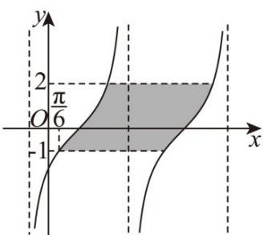

> [!faq]- 《专题5.4.3正切函数的性质与图像（高效培优讲义）数学人教A版2019高一必修第一册》官方解析
>
> > [!success]- **【答案】**  A. $\frac{\pi}{3}$ B. $-\frac{\pi}{4}$ C. $\frac{\pi}{6}$ D. $-\frac{\pi}{3}$
>
> > [!note]- **【解析】**
> > 设 $f(x)$ 的最小正周期为 $T$ ，则 $T\times [2 - (-1)] = 3T = 6\pi ,T = 2\pi$
> >
> > 所以 $\frac{\pi}{\omega} = 2\pi, \omega = \frac{1}{2}$ ，所以 $f(x) = \tan \left(\frac{1}{2} x + \varphi\right)$
> >
> > 由图可知 $f\left(\frac{\pi}{6}\right) = \tan \left(\frac{\pi}{12} +\varphi\right) = -1, - \frac{\pi}{2} <  \varphi <  \frac{\pi}{2}, - \frac{5\pi}{12} <  \varphi +\frac{\pi}{12} <   \frac{7\pi}{12}$
> >
> > 所以 $\frac{\pi}{12} +\varphi = -\frac{\pi}{4},\varphi = -\frac{\pi}{3}$
> >
> > 故选 **D**.
