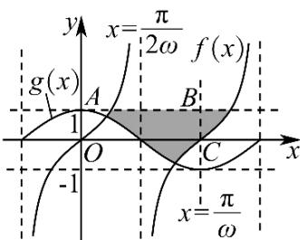

> [!faq]- 《专题5.4.3正切函数的性质与图像（高效培优讲义）数学人教A版2019高一必修第一册》官方解析
>
> > [!success]- **【答案】** (1) $\omega = \frac{\pi}{8}$ (2) $0 < a < 1$ 或 $1 < a \leq 2$
>
> > [!note]- **【解析】**
> > （1）如图，阴影部分的面积等价于矩形ABCO的面积，
> >
> > 
> >
> > 对于函数 $f(x) = \tan (\omega x)$ ，定义域为 $\left\{x \mid x \neq \frac{\pi}{2\omega} + \frac{k\pi}{\omega}, k \in \mathbf{Z}\right\}$
> >
> > 所以过点 $C$ 垂直于 $x$ 轴的直线为 $x = \frac{\pi}{\omega}$ ，又 $-1 \leq \cos (\omega x) \leq 1$ ，
> >
> > 则 $S_{矩形ABCO}=1\times\frac{\pi}{\omega}=8$ , 解得 $\omega=\frac{\pi}{8}$
> >
> > (2) 由 (1)，得 $f(x) = \tan\left(\frac{\pi}{8}x\right)$ ，当 $x \in [-2, 2]$ 时， $f_{\max}(x) = 1$ ，
> >
> > 故对任意 $x \in [-1, 1]$ 有 $h(x) \leq 1$ 成立·令 $t = a^x$ 且 $x \in [-1, 1]$ ，均有 $at - t^2 \leq 1$
> >
> > 对于 $y = at - t^2 = -(t - \frac{a}{2})^2 +\frac{a^2}{4}$ 开口向下，且对称轴为 $x = \frac{a}{2}$
> >
> > 当 $a > 1$ 时，则 $t \in [\frac{1}{a}, a]$ 上 $at - t^2 \leq 1$ 恒成立，
> >
> > 若 $\frac{a}{2} \leq \frac{1}{a}$ ，即 $1 < a \leq \sqrt{2}$ 时， $y = at - t^2$ 在 $t \in [\frac{1}{a}, a]$ 上单调递减，
> >
> > 所以 $y_{max} = 1 - \frac{1}{a^{2}} < 1$ ，满足题设；
> >
> > 若 $\frac{a}{2} >\frac{1}{a}$ ，即 $a > \sqrt{2}$ 时，显然 $\frac{1}{a} < \frac{a}{2} < \frac{1}{2a} +\frac{a}{2}$ ，即 $\left|\frac{1}{a} -\frac{a}{2}\right| <   \left|\frac{a}{2} -a\right|$
> >
> > 且 $y = at - t^2$ 在 $t \in \left[\frac{1}{a}, \frac{a}{2}\right)$ 上单调递增，在 $t \in \left(\frac{a}{2}, a\right]$ 上单调递减，
> >
> > 所以 $y_{\max} = \frac{a^2}{4} \leq 1$ ，此时 $\sqrt{2} < a \leq 2$ ；综上， $1 < a \leq 2$ 时满足题设；
> >
> > 当 $0 < a < 1$ 时，则 $t \in [a, \frac{1}{a}]$ 上 $at - t^2 \leq 1$ 恒成立，
> >
> > 显然 $\frac{a}{2} < a$ ，故 $y = at - t^2$ 在 $t \in [a, \frac{1}{a}]$ 上单调递减，所以 $y_{\max} = 0 < 1$ ，此时 $0 < a < 1$ ；
> >
> > 综上所述，0 < a < 1 或 $1 < a \leq 2$ .
