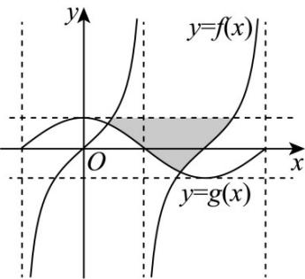

> [!faq]- 《专题5.4.3正切函数的性质与图像（高效培优讲义）数学人教A版2019高一必修第一册》官方解析
>
> > [!success]- **【答案】**  (1)求 $f(x)$ 的定义域（用区间表示）； (2)若 $h(x) = 3f(x) + x^2 -4$ 是定义在 $\left(-\frac{\pi}{2\omega},\frac{\pi}{2\omega}\right)$ 上的函数，求关于 $x$ 的不等式 $h(x)\leq 0$ 的解集.
>
> > [!note]- **【解析】**
> > （1）根据题意可得 $\frac{\pi}{\omega} \times 1 = 4$ ，解得 $\omega = \frac{\pi}{4}$ ，则 $f(x) = \tan \frac{\pi}{4} x$ 。
> >
> > 由 $-\frac{\pi}{2} + k\pi < \frac{\pi}{4} x < \frac{\pi}{2} + k\pi (k \in \mathbf{Z})$
> >
> > 得 $-2+4k<x<2+4k(k\in\mathbf{Z})$ ，即 $f(x)$ 的定义域为 $(-2+4k,2+4k)(k\in\mathbf{Z})$ .
> >
> > $(2) \text{由 } (1) \text{ 得 } h(x) = 3 \tan \frac{\pi}{4} x + x^{2} - 4 \text{，其定义域为 } (-2, 2).$
> >
> > 关于 $x$ 的不等式 $h(x) \leq 0$ 即 $3\tan \frac{\pi}{4} x + x^2 - 4 \leq 0$ ，即 $3\tan \frac{\pi}{4} x \leq 4 - x^2$ 。
> >
> > 当 $x\in (-2,0]$ 时， $\frac{\pi}{4} x\in \left(-\frac{\pi}{2},0\right]$ ，则 $3\tan \frac{\pi}{4} x\leq 0$
> >
> > 因为 $4 - x^{2} > 0$ ，所以 $\frac{3\tan\frac{\pi}{4}x <   4 - x^2}{4}$ 成立·
> >
> > 当 $x \in (0,2)$ 时，因为函数 $y = 3\tan \frac{\pi}{4} x$ 在 $(0,2)$ 上单调递增，
> >
> > 函数 $y = x^{2} - 4$ 在 $(0, 2)$ 上单调递增，所以 $h(x)$ 在 $(0, 2)$ 上单调递增，
> >
> > 因为 $h(1)=3\tan\frac{\pi}{4}+1^{2}-4=0$ ，所以 $0<x\leq1$ .
> >
> > 综上，关于 x 的不等式 $h(x) \leq 0$ 的解集为 $(-2,1]$ .
