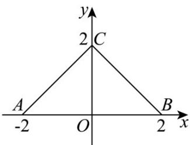

<!-- question-source:start -->
【典例1】如图，函数 $f(x)$ 的图象为折线 $ACB$ ，则不等式 $f(x) > \tan \frac{\pi}{4} x$ 的解集是（）

A $\{x\mid -2 <   x <   0\}$ B $\{x\mid 0 <   x <   1\}$

C $\{x\mid -2 <   x <   1\}$

$$
\{x \mid - 1 <   x <   2 \}
$$
<!-- question-source:end -->

![[高中/课堂同步/题库/人教A版高中数学同步讲义(2026)/01_必修第一册/第五章 三角函数/专题5.4.3正切函数的性质与图像（高效培优讲义）数学人教A版2019高一必修第一册/题型08_解不等式问题/questions/answers/Q00076394A1.md]]
