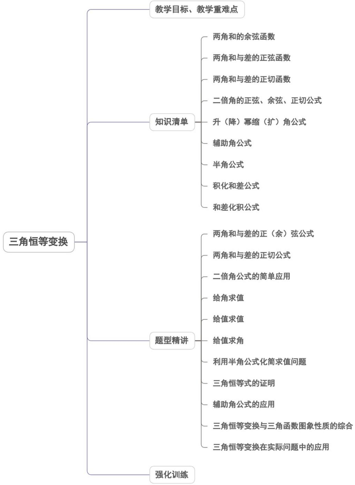
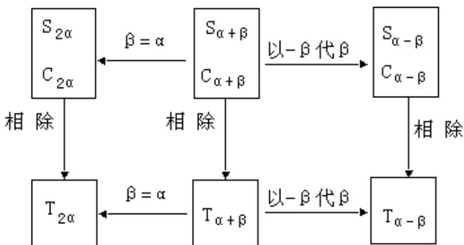
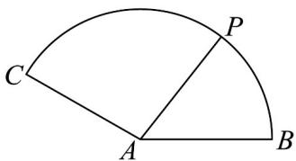
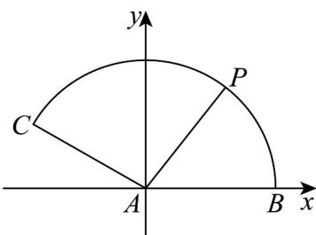

<!-- source-part:1 pages:1-50 -->

## 专题5.5 三角恒等变换

内容概览

教学目标、教学重难点

<table><tr><td>教学目标</td><td>1.理解与掌握两角差与和的余弦公式。2.能利用两角差的余弦公式导出两角差的正弦、正切公式。3.能利用两角和与差的正弦、余弦、正切公式求值(角)、化简、证明等问题的解决。4.掌握二倍角的正弦、余弦和正切公式的内容。5.会运用二倍角的三角函数公式解决三角函数式的化简、求值与证明。6.会运用三角函数的正弦、余弦、正切的和与差、二倍角公式进行三角函数式的化简与求值。7.会运用相应的三角函数公式进行三角函数式的证明。</td></tr><tr><td>教学重难点</td><td>1.重点:会利用两角和与差的正弦、余弦、正切公式进行三角函数式的求值、化简及证明。2.难点:掌握二倍角公式的恒等变形与应用,解决与二倍角有关的三角函数式的计算与证明。会运用三角函数的相关公式进行简单的三角恒等变换,并能解决与三角函数有关的计算、化简、证明等问题。</td></tr></table>

## 知识清单

## 知识点 01 两角和的余弦函数

两角和的余弦公式： $\cos (\alpha +\beta) = \cos \alpha \cos \beta -\sin \alpha \sin \beta$

【即学即练】

1. 已知 $\sin(\alpha-\beta)\cos\alpha-\cos(\beta-\alpha)\sin\alpha=\frac{2\sqrt{5}}{5}$ ， $\beta$ 是第四象限角，则 $\cos\left(\beta+\frac{5\pi}{4}\right)$ 的值是（）

【答案】
A. $\frac{\sqrt{10}}{10}$ B. $-\frac{\sqrt{10}}{10}$ C. $\frac{3\sqrt{10}}{10}$ D. $-\frac{3\sqrt{10}}{10}$

【答案】D

【详解】由 $\sin (\alpha -\beta)\cos \alpha -\cos (\beta -\alpha)\sin \alpha = \frac{2\sqrt{5}}{5}$ 得 $\sin [(\alpha -\beta) - \alpha ] = \frac{2\sqrt{5}}{5}$

即 $\sin (-\beta) = \frac{2\sqrt{5}}{5}$ ，所以 $\sin \beta = -\frac{2\sqrt{5}}{5}$

∵ $\beta$ 是第四象限角，∴ $\cos\beta=\sqrt{1-\sin^{2}\beta}=\sqrt{1-\left(-\frac{2\sqrt{5}}{5}\right)^{2}}=\frac{\sqrt{5}}{5}$ .

$$
\cos \left(\beta + \frac {5 \pi}{4}\right) = - \cos \left(\beta + \frac {\pi}{4}\right) = - \left[ \frac {\sqrt {2}}{2} \times \frac {\sqrt {5}}{5} - \frac {\sqrt {2}}{2} \times \left(- \frac {2 \sqrt {5}}{5}\right) \right] = - \frac {3 \sqrt {1 0}}{1 0}.
$$

故选：D.

2. 已知 $\sin\left(\frac{\pi}{4}+\alpha\right)=-\frac{3}{5}$ ， $\cos\left(\frac{3\pi}{4}+\beta\right)=\frac{12}{13}$ ， $\alpha\in\left(\frac{3\pi}{4},\frac{5\pi}{4}\right)$ ， $\beta\in\left(\frac{\pi}{4},\frac{5\pi}{4}\right)$ ，则 $\cos(\alpha-\beta)=$ （）A. $-\frac{16}{65}$ B. $\frac{16}{65}$ C. $-\frac{56}{65}$ D. $\frac{56}{65}$

【答案】D

【详解】因为 $\cos\left(\frac{3\pi}{4}+\beta\right)=-\sin\left(\frac{\pi}{4}+\beta\right)=\frac{12}{13}$ ，所以 $\sin\left(\frac{\pi}{4}+\beta\right)=-\frac{12}{13}$

因为 $\beta \in \left(\frac{\pi}{4},\frac{5\pi}{4}\right)$ ，则 $\frac{\pi}{4} +\beta \in \left(\frac{\pi}{2},\frac{3\pi}{2}\right)$ ，所以 $\cos \left(\frac{\pi}{4} +\beta\right) = -\sqrt{1 - \left(-\frac{12}{13}\right)^2} = -\frac{5}{13}$

因为 $\alpha \in \left(\frac{3\pi}{4},\frac{5\pi}{4}\right)$ ，则 $\frac{\pi}{4} +\alpha \in \left(\pi ,\frac{3\pi}{2}\right)$

又 $\sin \left(\frac{\pi}{4} +\alpha\right) = -\frac{3}{5}$ ，所以 $\cos \left(\frac{\pi}{4} +\alpha\right) = -\sqrt{1 - \left(-\frac{3}{5}\right)^2} = -\frac{4}{5}.$

$$
\cos (\alpha - \beta) = \cos \left[ \left(\frac {\pi}{4} + \alpha\right) - \left(\frac {\pi}{4} + \beta\right) \right] = \cos \left(\frac {\pi}{4} + \alpha\right) \cos \left(\frac {\pi}{4} + \beta\right) + \sin \left(\frac {\pi}{4} + \alpha\right) \sin \left(\frac {\pi}{4} + \beta\right)
$$

$$
= \left(- \frac {4}{5}\right) \times \left(- \frac {5}{1 3}\right) + \left(- \frac {3}{5}\right) \times \left(- \frac {1 2}{1 3}\right) = \frac {5 6}{6 5}.
$$

故选：D.

## 知识点 02 两角和与差的正弦函数

两角和正弦函数 $\sin (\alpha +\beta) = \sin \alpha \cos \beta +\cos \alpha \sin \beta$

在公式 $S_{(\alpha + \beta)}$ 中用 $-\beta$ 代替 $\beta$ ，就得到：两角差的正弦函数 $\sin (\alpha - \beta) = \sin \alpha \cos \beta - \cos \alpha \sin \beta S_{(\alpha - \beta)}$

## 【即学即练】

1. 若点 $P(-1,1)$ 在角 $\alpha$ 的终边上，则 $\sin (\alpha + 2025^\circ) = (\quad)$ A. -1 B. $-\frac{\sqrt{2}}{2}$ C. 0 D. 1

【答案】C

【详解】点 $P(-1,1)$ 在角 $\alpha$ 的终边上，则 $\sin \alpha = \frac{1}{\sqrt{(-1)^2 + 1^2}} = \frac{\sqrt{2}}{2},\cos \alpha = \frac{-1}{\sqrt{(-1)^2 + 1^2}} = -\frac{\sqrt{2}}{2}$ ， $\sin (\alpha +2025^{\circ}) = \sin (\alpha +225^{\circ}) = \sin (\alpha -135^{\circ}) = \frac{\sqrt{2}}{2}\times \left(-\frac{\sqrt{2}}{2}\right) + \frac{\sqrt{2}}{2}\times \left(\frac{\sqrt{2}}{2}\right) = 0.$

故选：C.

2. 锐角 VABC 的内角 A, B, C 满足 $\sin C - \sin B = 2\sin B\cos A$ ，则 $\overline{\sin C}$ 的取值范围为（）

【答案】
A. $\left(0,\frac{1}{2}\right)$ B. $\left(\frac{1}{3},1\right)$ C.(0,1) D. $\left(\frac{1}{2},1\right)$

$$
\frac {\sin B}{\sin C}
$$

【答案】D

【详解】∵ $\sin C - \sin B = 2\sin B\cos A$ ，∴ $\sin(A + B) - \sin B = 2\sin B\cos A$ .

$\therefore \sin (A - B) = \sin B$ ， $\therefore A - B = B$ ， $\therefore A = 2B$ ，从而 $C = \pi -3B$

$$
\frac {\sin B}{\sin C} = \frac {\sin B}{\sin 3 B} = \frac {\sin B}{\sin B \cos 2 B + \cos B \sin 2 B} = \frac {1}{4 \cos^ {2} B - 1}
$$

∵ $\triangle ABC$ 为锐角三角形.

$$
\therefore \left\{ \begin{array}{l} 0 <   B <   \frac {\pi}{2} \\ 0 <   2 B <   \frac {\pi}{2} \quad \Rightarrow \frac {\pi}{6} <   B <   \frac {\pi}{4} \\ 0 <   \pi - 3 B <   \frac {\pi}{2} \end{array} \right.
$$

$$
\therefore \cos B \in \left(\frac {\sqrt {2}}{2}, \frac {\sqrt {3}}{2}\right), 4 \cos^ {2} B - 1 \in (1, 2)    ,   \text {从而}   \frac {\sin B}{\sin C} = \frac {1}{4 \cos^ {2} B - 1} \in \left(\frac {1}{2}, 1\right).
$$

故选：D.

## 知识点 03 两角和与差的正切函数

$$
\tan (\alpha + \beta) = \frac {\tan \alpha + \tan \beta}{1 - \tan \alpha \tan \beta}
$$

$$
\tan (\alpha - \beta) = \frac {\tan \alpha - \tan \beta}{1 + \tan \alpha \tan \beta}
$$

【即学即练】

1. 已知 $\sin 2\alpha = m, \sin 2\beta = n$ ，且 $m \neq n$ ，则 $\frac{\tan (\alpha + \beta)}{\tan (\alpha - \beta)} = (\quad)$ A. $\frac{m - n}{m + n}$ B. $\frac{m + n}{m - n}$ C. $\frac{n}{m}$ D. $\frac{m}{n}$

【答案】B

$$
\sin 2 \alpha = \sin [ (\alpha + \beta) + (\alpha - \beta) ] = \sin (\alpha + \beta) \cos (\alpha - \beta) + \cos (\alpha + \beta) \sin (\alpha - \beta) = m
$$

$$
\sin 2 \beta = \sin [ (\alpha + \beta) - (\alpha - \beta) ] = \sin (\alpha + \beta) \cos (\alpha - \beta) - \cos (\alpha + \beta) \sin (\alpha - \beta) = n
$$

所以： $\sin (\alpha +\beta)\cos (\alpha -\beta) = \frac{m + n}{2}\quad \cos (\alpha +\beta)\sin (\alpha -\beta) = \frac{m - n}{2}$

$$
\frac {\tan (\alpha + \beta)}{\tan (\alpha - \beta)} = \frac {\sin (\alpha + \beta) \cos (\alpha - \beta)}{\cos (\alpha + \beta) \sin (\alpha - \beta)} = \frac {\frac {m + n}{2}}{\frac {m - n}{2}} = \frac {m + n}{m - n}.
$$

故选：B

2. 已知 $\frac{\sin\alpha}{\cos\alpha - \sin\alpha} = 2$ ，则 $\tan\left(\alpha + \frac{\pi}{4}\right) = (\quad)$ . A. -3 B. 2 C. 3 D. 5

【答案】D

【详解】因为 $\frac{\sin\alpha}{\cos\alpha - \sin\alpha} = 2$ ，所以 $\frac{\frac{\sin\alpha}{\cos\alpha}}{\frac{\cos\alpha - \sin\alpha}{\cos\alpha}} = 2(\cos\alpha \neq 0)$

即 $\frac{\tan\alpha}{1 - \tan\alpha} = 2$ ，解得 $\tan \alpha = \frac{2}{3}$ ，所以 $\tan \left(\alpha +\frac{\pi}{4}\right) = \frac{\tan\alpha + \tan\frac{\pi}{4}}{1 - \tan\alpha\cdot\tan\frac{\pi}{4}} = \frac{\frac{2}{3} + 1}{1 - \frac{2}{3}} = 5$

故选：D.

## 知识点 04 二倍角的正弦、余弦、正切公式

## 1、二倍角的正弦、余弦、正切公式

$$
\sin 2 \alpha = 2 \sin \alpha \cdot \cos \alpha \quad (S _ {2 \alpha})
$$

$$
\begin{array}{r l} \cos 2 \alpha & = \cos^ {2} \alpha - \sin^ {2} \alpha (C _ {2 \alpha}) \\ & = 2 \cos^ {2} \alpha - 1 \\ & = 1 - 2 \sin^ {2} \alpha \end{array}
$$

$$
\tan 2 \alpha = \frac {2 \tan \alpha}{1 - \tan^ {2} \alpha} (T _ {2 \alpha})
$$

## 2、和角公式、倍角公式之间的内在联系

在两角和的三角函数公式 $S_{\alpha +\beta}$ ， $C_{\alpha +\beta}$ ， $T_{\alpha +\beta}$ 中，当 $\alpha = \beta$ 时，就可得到二倍角的三角函数公式，它们的内在

联系如下：

## 【即学即练】

1. 若 $x \in \left[\frac{\pi}{4}, \frac{\pi}{2}\right]$ ，则 $\sqrt{2 - 2\sin 2x} + \sqrt{1 + \cos 2x} =$ （）

【答案】

A. $\sqrt{2} \sin x$ B. $\sqrt{2} \cos x$ C. $\sin x$ D. $\cos x$

【答案】A

【详解】 $\sqrt{2 - 2\sin 2x} = \sqrt{2 - 4\sin x\cos x} = \sqrt{2(1 - 2\sin x\cos x)} = \sqrt{2}\sqrt{(\sin x - \cos x)^2}$

因为 $x \in \left[\frac{\pi}{4}, \frac{\pi}{2}\right]$ ，所以 $\sin x - \cos x = 0$ ，

所以 $\sqrt{2}\sqrt{(\sin x-\cos x)^{2}}=\sqrt{2}(\sin x-\cos x)$

因为 $\sqrt{1+\cos2x}=\sqrt{1+2\cos^{2}x-1}=\sqrt{2\cos^{2}x}=\sqrt{2}\cos x$

原式 $= \sqrt{2} (\sin x - \cos x) + \sqrt{2}\cos x = \sqrt{2}\sin x.$

故答案为：A.

2. 设 $\theta$ 是锐角， $\cos \left( \theta + \frac{\pi}{4} \right) = \cos \left( \theta - \frac{\pi}{4} \right) \tan 2\theta$ ，则 $\tan \theta = (\quad)$ A. $\sqrt{3} + 2$ B. $2 - \sqrt{3}$ C. $2 \pm \sqrt{3}$ D. $\frac{2 - \sqrt{3}}{2}$

【答案】C

【详解】利用两角和与差的余弦公式展开 $\cos (\theta +\frac{\pi}{4})$ 与 $\cos (\theta -\frac{\pi}{4})$ 可得：

$$
\cos \left(\theta + \frac {\pi}{4}\right) = \cos \theta \cos \frac {\pi}{4} - \sin \theta \sin \frac {\pi}{4} = \frac {\sqrt {2}}{2} (\cos \theta - \sin \theta)
$$

$$
\cos \left(\theta - \frac {\pi}{4}\right) = \cos \theta \cos \frac {\pi}{4} + \sin \theta \sin \frac {\pi}{4} = \frac {\sqrt {2}}{2} (\cos \theta + \sin \theta)
$$

$\tan 2\theta = \frac{2\tan\theta}{1 - \tan^{2}\theta}.$ 根据正切函数的二倍角公式

将 $\cos (\theta +\frac{\pi}{4})$ 、 $\cos (\theta -\frac{\pi}{4})$ 、 $\tan 2\theta$ 代入原等式 $\cos (\theta +\frac{\pi}{4}) = \cos (\theta -\frac{\pi}{4})\tan 2\theta$ 可得：

$$
\frac {\sqrt {2}}{2} (\cos \theta - \sin \theta) = \frac {\sqrt {2}}{2} (\cos \theta + \sin \theta) \cdot \frac {2 \tan \theta}{1 - \tan^ {2} \theta}
$$

因为 $\theta$ 是锐角， $\cos \theta \neq 0$ ，等式两边同时除以 $\frac{\sqrt{2}}{2} \cos \theta$ 得：

$1 - \tan\theta = (1 + \tan\theta) \cdot \frac{2\tan\theta}{1 - \tan^{2}\theta}$ ，化为： $1 - \tan\theta = \frac{2\tan\theta}{1 - \tan\theta}$

等式两边同时乘以 $1 - \tan \theta$ 得： $(1 - \tan \theta)^{2} = 2\tan \theta$

展开得： $1 - 2\tan \theta +\tan^2\theta = 2\tan \theta$ ，则 $\tan^2\theta -4\tan \theta +1 = 0$

$$
\tan \theta = \frac {4 \pm \sqrt {(- 4) ^ {2} - 4 \times 1 \times 1}}{2 \times 1} = \frac {4 \pm \sqrt {1 2}}{2} = \frac {4 \pm 2 \sqrt {3}}{2} = 2 \pm \sqrt {3}
$$

因为 $\theta$ 是锐角， $\tan \theta > 0$ ，所以 $\tan \theta = 2 \pm \sqrt{3}$ 都符合条件。 $\tan \theta = 2 \pm \sqrt{3}$ .

故选：C.

## 知识点 05 升（降）幂缩（扩）角公式

升幂公式： $1 + \cos 2\alpha = 2\cos^2\alpha$ ， $1 - \cos 2\alpha = 2\sin^2\alpha$

降幂公式： $\cos^2\alpha = \frac{1 + \cos 2\alpha}{2},\sin^2\alpha = \frac{1 - \cos 2\alpha}{2}$

【即学即练】

1. 已知 $\tan \theta = \frac{8}{15}$ ， $\theta \in \left(0, \frac{\pi}{2}\right)$ ，则 $\frac{1 + \sin \theta + \cos \theta}{\sin \frac{\theta}{2} + \cos \frac{\theta}{2}} = (\quad)$ A. $\frac{8\sqrt{17}}{17}$ B. $\frac{4\sqrt{17}}{17}$ C. $\frac{\sqrt{17}}{17}$ D. $\frac{2\sqrt{17}}{17}$

【答案】A

【详解】 $\frac{1 + \sin\theta + \cos\theta}{\sin\frac{\theta}{2} + \cos\frac{\theta}{2}} = \frac{2\cos^2\frac{\theta}{2} + \sin\theta}{\sin\frac{\theta}{2} + \cos\frac{\theta}{2}} = \frac{2\cos\frac{\theta}{2}\left(\cos\frac{\theta}{2} + \sin\frac{\theta}{2}\right)}{\sin\frac{\theta}{2} + \cos\frac{\theta}{2}} = 2\cos\frac{\theta}{2}$

因为 $\tan \theta = \frac{8}{15}$ ，即 $\left\{ \begin{array}{l} \sin^2\theta + \cos^2\theta = 1 \\ \frac{\sin\theta}{\cos\theta} = \frac{8}{15} \end{array} \right.$ ， $\theta \in \left(0, \frac{\pi}{2}\right)$

解得 $\left\{ \begin{array}{l} \sin \theta = \frac{8}{17} \\ \cos \theta = \frac{15}{17} \end{array} \right.$ 又 $\frac{\theta}{2} \in \left(0, \frac{\pi}{2}\right)$ , $\cos \frac{\theta}{2} = \sqrt{\frac{1 + \cos \theta}{2}} = \frac{4\sqrt{17}}{17}$ ,

所以 $2\cos\frac{\theta}{2}=\frac{8\sqrt{17}}{17}$

故选：A.

2. 已知 $\sin \theta, \cos \theta$ 是方程 $x^{2} - 2\sin \alpha \cdot x + \sin^{2}\beta = 0$ 的两个实根，则 $\frac{\cos 2\beta}{\cos 2\alpha} =$ （）A.4 B.3 C.2 D.1

【答案】C

【详解】∵ $\sin\theta,\cos\theta$ 是方程 $x^{2}-2\sin\alpha\cdot x+\sin^{2}\beta=0$ 的两个实根，

$\therefore \sin \theta +\cos \theta = 2\sin \alpha$

$$
\sin^ {2} \theta - 2 \sin \alpha \cdot \sin \theta + \sin^ {2} \beta = 0 - ①
$$

$$
\cos^ {2} \theta - 2 \sin \alpha \cdot \cos \theta + \sin^ {2} \beta = 0 \tag {②}
$$

①式 + ②式得： $1 - 2\sin\alpha \cdot (\sin\theta + \cos\theta) + 2\sin^{2}\beta = 0$

即 $1 - 4\sin^2\alpha + 2\sin^2\beta = 0$

$2-4\sin^{2}\alpha=1-2\sin^{2}\beta$ ，即 $2\cos2\alpha=\cos2\beta$ ，得 $\frac{\cos2\beta}{\cos2\alpha}=2$

故选：C.

## 知识点 06 辅助角公式

$a\sin x + b\cos x = \sqrt{a^2 + b^2}\left(\frac{a}{\sqrt{a^2 + b^2}}\sin x + \frac{b}{\sqrt{a^2 + b^2}}\cos x\right)$ 1、形如 $a\sin x + b\cos x$ 的三角函数式的变形：

令

$$
\cos \varphi = \frac {a}{\sqrt {a ^ {2} + b ^ {2}}}
$$

$$
\sin \varphi = \frac {b}{\sqrt {a ^ {2} + b ^ {2}}}
$$

则

$$
a \sin x + b \cos x = \sqrt {a ^ {2} + b ^ {2}} (\sin x \cos \varphi + \cos x \sin \varphi) = \sqrt {a ^ {2} + b ^ {2}} \sin (x + \varphi)
$$

(其中 $\varphi$ 角所在象限由 a, b 的符号确定， $\varphi$ 角的值由 $\tan\varphi=\frac{b}{a}$ 确定，或由 $\sin\varphi=\frac{b}{\sqrt{a^{2}+b^{2}}}$ 和 $\cos\varphi=\frac{a}{\sqrt{a^{2}+b^{2}}}$

共同确定．）

## 2、辅助角公式在解题中的应用

通过应用公式 $a\sin x + b\cos x = \sqrt{a^2 + b^2}\sin (x + \varphi)$ （或 $a\sin x + b\cos x = \sqrt{a^2 + b^2}\cos (\alpha -\varphi)$ ），将形如 $a\sin x + b\cos x$ （ $a,b$ 不同时为零）收缩为一个三角函数 $\sqrt{a^2 + b^2}\sin (x + \varphi)$ （或 $\sqrt{a^2 + b^2}\cos (\alpha -\varphi)$ ）.这种恒

等变形实质上是将同角的正弦和余弦函数值与其他常数积的和变形为一个三角函数，这样做有利于函数式的

化简、求值等．

【即学即练】

1. 已知 $\cos\alpha+\sqrt{3}\sin\alpha=\frac{4}{5}$ ，则 $\cos(2\alpha+\frac{\pi}{3})$ 的值是（）

【答案】
A. $-\frac{21}{25}$ B. $-\frac{17}{25}$ C. $\frac{17}{25}$ D. $\frac{21}{25}$

【答案】C

【详解】依题意， $\frac{4}{5}=\cos\alpha+\sqrt{3}\sin\alpha=2(\frac{1}{2}\cos\alpha+\frac{\sqrt{3}}{2}\sin\alpha)=2\sin(\alpha+\frac{\pi}{6})$ ，解得 $\sin(\alpha+\frac{\pi}{6})=\frac{2}{5}$

所以 $\cos (2\alpha +\frac{\pi}{3}) = 1 - 2\sin^2 (\alpha +\frac{\pi}{6}) = 1 - 2\times \frac{4}{25} = \frac{17}{25}$

故选：C

2. 如图，扇形的半径为1，圆心角 $\angle BAC = 150^{\circ}$ ，点 $P$ 在弧 $BC$ 上运动， $AP = \lambda AB + \mu AC$ ，则 $\sqrt{3}\lambda - \mu$ 的最

小值是（）

A. 2 B. $\sqrt{3}$ C. $-\sqrt{3}$ D. -1

【答案】D

【详解】以点A为坐标原点，AB所在直线为x轴，过点A且垂直于AB的直线为y轴建立如下图所示的平面

直角坐标系，

则 $A(0,0)$ 、 $B(1,0)$ 、 $C\left(-\frac{\sqrt{3}}{2}, \frac{1}{2}\right)$ ，设点 $P(\cos \theta, \sin \theta)$ ，其中 $0 \leq \theta \leq \frac{5\pi}{6}$

由 $\overline{AP} = \overline{\lambda AB} +\mu \overline{AC}$ 可得 $(\cos \theta ,\sin \theta) = \lambda (1,0) + \mu \left(-\frac{\sqrt{3}}{2},\frac{1}{2}\right)$

即 $\left\{ \begin{array}{l} \lambda - \frac{\sqrt{3}}{2} \mu = \cos \theta \\ \frac{1}{2} \mu = \sin \theta \end{array} \right.$ ，故 $\sqrt{3} \lambda - \mu = \sqrt{3} \left( \lambda - \frac{\sqrt{3}}{2} \mu \right) + \frac{1}{2} \mu = \sqrt{3} \cos \theta + \sin \theta = 2 \sin \left( \theta + \frac{\pi}{3} \right)$ ，

因为 $0 \leq \theta \leq \frac{5\pi}{6}$ ，故 $\frac{\pi}{3} \leq \theta + \frac{\pi}{3} \leq \frac{7\pi}{6}$ ，

故当 $\theta + \frac{\pi}{3} = \frac{7\pi}{6}$ 时， $\sqrt{3}\lambda - \mu$ 取最小值 $2\sin\frac{7\pi}{6} = -1$

故选：D.

## 知识点 07 半角公式

$$
\sin \frac {\alpha}{2} = \pm \sqrt {\frac {1 - \cos \alpha}{2}}
$$

$$
\cos \frac {\alpha}{2} = \pm \sqrt {\frac {1 + \cos \alpha}{2}}
$$

$$
\tan {\frac {\alpha}{2}} = \pm \sqrt {\frac {1 - \cos \alpha}{1 + \cos \alpha}}
$$

以上三个公式分别称作半角正弦、余弦、正切公式，它们是用无理式表示的。

$$
\tan \frac {\alpha}{2} = \frac {\sin \alpha}{1 + \cos \alpha}, \tan \frac {\alpha}{2} = \frac {1 - \cos \alpha}{\sin \alpha}
$$

以上两个公式称作半角正切的有理式表示.

【即学即练】

1. 已知 $a = \sqrt{\frac{1 - \cos 66^\circ}{2}}, b = \frac{1 + \tan 19^\circ}{1 - \tan 19^\circ}, c = 2\cos^2 34^\circ - 1$ ，则下列选项正确的是（）A. $a > c > b$ B. $c > a > b$ C. $b > c > a$ D. $b > a > c$

【答案】D

【详解】因为 $\sqrt{\frac{1 - \cos 66^\circ}{2}} = \sqrt{\sin^233^\circ} = \sin 33^\circ$ ，所以 $a = \sin 33^{\circ} = \cos 57^{\circ}$

根据正切两角和的公式得 $b = \frac{1 + \tan 19^{\circ}}{1 - \tan 19^{\circ}} = \frac{\tan 45^{\circ} + \tan 19^{\circ}}{1 - \tan 45^{\circ} \cdot \tan 19^{\circ}} = \tan (45^{\circ} + 19^{\circ}) = \tan 64^{\circ}$

根据二倍角公式可知 $c = 2\cos^2 34^\circ - 1 = \cos 68^\circ$

根据余弦函数在 $(0, \frac{\pi}{2})$ 上单调递减，且值域为 $(0, 1)$ ，所以 $1 > \cos 57^\circ > \cos 68^\circ$

正切函数在 $(0, \frac{\pi}{2})$ 上单调递增，所以 $\tan 64^{\circ} > \tan 45^{\circ}$ ，

所以 $\tan 64^{\circ} > 1 > \cos 57^{\circ} > \cos 68^{\circ}$

故选：D.

2. 已知 $\alpha$ 是第四象限角，若 $\cos \alpha = \frac{1}{5}$ ，则 $\tan \frac{\alpha}{2} = (\quad)$ A. $\frac{\sqrt{6}}{2}$ B. $-\frac{\sqrt{6}}{2}$ C. $\frac{\sqrt{6}}{3}$ D. $-\frac{\sqrt{6}}{3}$

【答案】D

【详解】因为 $\alpha$ 是第四象限角，又因为 $\cos \alpha = \frac{1}{5}$ ，则 $\sin \alpha = -\sqrt{1 - \frac{1}{25}} = -\frac{2\sqrt{6}}{5}$ ，所以 $\tan \frac{\alpha}{2} = \frac{\sin \alpha}{1 + \cos \alpha} = \frac{-\frac{2\sqrt{6}}{5}}{1 + \frac{1}{5}} = -\frac{\sqrt{6}}{3}$ .

故选：D.

## 知识点 08 积化和差公式

$\sin \alpha \cos \beta = \frac{1}{2} [\sin (\alpha -\beta) + \sin (\alpha +\beta)]$ $\cos \alpha \sin \beta = \frac{1}{2} [\sin (\alpha +\beta) - \sin (\alpha -\beta)]$ $\cos \alpha \cos \beta = \frac{1}{2} [\cos (\alpha -\beta) + \cos (\alpha +\beta)]$ $\sin \alpha \sin \beta = \frac{1}{2} [\cos (\alpha -\beta) - \cos (\alpha +\beta)]$

## 【即学即练】

1. 计算： $\cos 20^{\circ} \cos 40^{\circ} - \cos 40^{\circ} \cos 80^{\circ} + \cos 80^{\circ} \cos 20^{\circ} = (\quad)$

A. $\frac{1}{2}$ B. $\frac{2}{3}$ C. $\frac{3}{4}$ D. $\frac{\sqrt{3}}{2}$

【答案】C

【详解】

$\begin{aligned} & \cos 20^{\circ}\cos 40^{\circ} - \cos 40^{\circ}\cos 80^{\circ} + \cos 80^{\circ}\cos 20^{\circ} = \frac{1}{2}\left[\cos (40^{\circ} + 20^{\circ}) + \cos (40^{\circ} - 20^{\circ})\right] - \frac{1}{2}\left[\cos (80^{\circ} + 40^{\circ}) + \cos (80^{\circ} - 40^{\circ})\right]\\ & +\frac{1}{2}\left[\cos (80^{\circ} + 20^{\circ}) + \cos (80^{\circ} - 20^{\circ})\right]\\ & = \frac{1}{2}\left[\frac{1}{2} +\cos 20^{\circ}\right] - \frac{1}{2}\left[-\frac{1}{2} +\cos 40^{\circ}\right] + \frac{1}{2}\left[\cos 100^{\circ} + \frac{1}{2}\right] = \frac{3}{4} +\frac{1}{2}\left[\cos 20^{\circ} - \cos 40^{\circ} + \cos 100^{\circ}\right]\\ & = \frac{3}{4} +\frac{1}{2}\left[\cos 20^{\circ} - \cos 40^{\circ} + \cos 100^{\circ}\right] = \frac{3}{4} +\frac{1}{2}\left[\cos (30^{\circ} - 10^{\circ}) - \cos (30^{\circ} + 10^{\circ}) - \sin 10^{\circ}\right]\\ & = \frac{3}{4} +\frac{1}{2}\left[2\sin 30^{\circ}\sin 10^{\circ} - \sin 10^{\circ}\right] = \frac{3}{4}, \end{aligned}$

故选：C

2. $2\sin \frac{7\pi}{11}\sin \frac{2\pi}{11} - \sin \frac{\pi}{22} + \cos \frac{2\pi}{11} =$ ( )

【答案】

A. 0

B. $\sin \frac{2\pi}{11}$ C. $2\cos \frac{2\pi}{11}$ D. $2\sin \frac{2\pi}{11}$

【答案】C

【详解】 $2\sin \frac{7\pi}{11}\sin \frac{2\pi}{11} -\sin \frac{\pi}{22} +\cos \frac{2\pi}{11}$ $= \cos \left(\frac{7\pi}{11} -\frac{2\pi}{11}\right) - \cos \left(\frac{7\pi}{11} +\frac{2\pi}{11}\right) - \cos \left(\frac{\pi}{2} -\frac{\pi}{22}\right) + \cos \frac{2\pi}{11}$

$$
= \cos \frac {5 \pi}{1 1} - \cos \frac {9 \pi}{1 1} - \cos \frac {5 \pi}{1 1} + \cos \frac {2 \pi}{1 1}
$$

$$
= - \cos \left(\pi - \frac {2 \pi}{1 1}\right) + \cos \frac {2 \pi}{1 1} = 2 \cos \frac {2 \pi}{1 1},
$$

故选：C

## 知识点 09 和差化积公式

$$
\sin x + \sin y = 2 \sin \frac {x + y}{2} \cos \frac {x - y}{2}
$$

$$
\sin x - \sin y = 2 \cos \frac {x + y}{2} \sin \frac {x - y}{2}
$$

$$
\cos x + \cos y = 2 \cos \frac {x + y}{2} \cos \frac {x - y}{2}
$$

$$
\cos x - \cos y = - 2 \sin \frac {x + y}{2} \sin \frac {x - y}{2}
$$

【即学即练】

1. 若 $A$ 是 $\mathrm{V}ABC$ 的内角，且 $\sin A - \cos A = \frac{17}{13}$ ，则 $\frac{5\sin A + 4\cos A}{5\sin A - 7\cos A}$ 的值为（）A. $\frac{8}{19}$ B. $-\frac{8}{19}$ C. $-\frac{16}{5}$ D. $\frac{16}{5}$

【答案】A

【详解】由 $\sin A - \cos A = \frac{17}{13}$ 可得 $(\sin A - \cos A)^{2} = \frac{289}{169}$

$$
\sin^ {2} A - 2 \sin A \cos A + \cos^ {2} A = \frac {2 8 9}{1 6 9}
$$

$$
1 - \sin 2 A = \frac {2 8 9}{1 6 9} \therefore \sin 2 A = - \frac {1 2 0}{1 6 9}, (\sin A + \cos A) ^ {2} = 1 + \sin 2 A = \frac {4 9}{1 6 9},
$$

$\because A\in\left(\frac{\pi}{2},\pi\right)\therefore\sin A+\cos A=\frac{7}{13}$ ，所以 $\sin A=\frac{12}{13},\cos A=-\frac{5}{13}$

所以 $\tan A = \frac{\sin A}{\cos A} = -\frac{12}{5}$

所以 $\frac{5\sin A + 4\cos A}{5\sin A - 7\cos A} = \frac{5\tan A + 4}{5\tan A - 7} = \frac{-8}{-19} = \frac{8}{19}$ .

$\because A\in\left(\frac{\pi}{2},\pi\right)\therefore\sin A+\cos A=-\frac{7}{13}$ ，所以 $\sin A=\frac{5}{13},\cos A=-\frac{12}{13}$ ;

所以 $\tan A = \frac{\sin A}{\cos A} = -\frac{5}{12}$

所以 $\frac{5\sin A + 4\cos A}{5\sin A - 7\cos A} = \frac{5\tan A + 4}{5\tan A - 7} = \frac{-\frac{25}{12} + 4}{-\frac{25}{12} - 7} = -\frac{23}{109}$

故选：A

2. 已知锐角 $x$ 满足 $\sin 3x - \sin x > 0$ ，则 $x$ 的取值范围为（）A. $\left(0, \frac{\pi}{6}\right)$ B. $\left(0, \frac{\pi}{4}\right)$ C. $\left(\frac{\pi}{6}, \frac{\pi}{3}\right)$ D. $\left(\frac{\pi}{4}, \frac{\pi}{3}\right)$

【答案】B

【详解】由和差化积公式得 $\sin3x - \sin x = 2\cos2x\sin x$

欲求 $\sin 3x - \sin x > 0$ ，则求 $2\cos 2x\sin x > 0$ 即可，

因为 x 是锐角，所以 $x \in \left(0, \frac{\pi}{2}\right)$ ，且 $\sin x > 0$ ，

故求 $\cos 2x > 0$ 即可，解得 $2x\in (2k\pi -\frac{\pi}{2},2k\pi +\frac{\pi}{2}),k\in Z$ 则 $x\in (k\pi -\frac{\pi}{4},k\pi +\frac{\pi}{4}),k\in Z$ ，当 $k = 0$ 时， $x\in (-\frac{\pi}{4},\frac{\pi}{4})$

而 $x \in \left(0, \frac{\pi}{2}\right)$ ，得到 $x \in \left(0, \frac{\pi}{4}\right)$ ，故 B 正确·

故选：B

## 题型精讲

![[高中/课堂同步/题库/人教A版高中数学同步讲义(2026)/01_必修第一册/第五章 三角函数/专题5.5三角恒等变换（高效培优讲义）数学人教A版2019高一必修第一册/题型01_两角和与差的正_余_弦公式/题型01_两角和与差的正_余_弦公式.md]]
![[高中/课堂同步/题库/人教A版高中数学同步讲义(2026)/01_必修第一册/第五章 三角函数/专题5.5三角恒等变换（高效培优讲义）数学人教A版2019高一必修第一册/题型02_两角和与差的正切公式/题型02_两角和与差的正切公式.md]]
![[高中/课堂同步/题库/人教A版高中数学同步讲义(2026)/01_必修第一册/第五章 三角函数/专题5.5三角恒等变换（高效培优讲义）数学人教A版2019高一必修第一册/题型03_二倍角公式的简单应用/题型03_二倍角公式的简单应用.md]]
![[高中/课堂同步/题库/人教A版高中数学同步讲义(2026)/01_必修第一册/第五章 三角函数/专题5.5三角恒等变换（高效培优讲义）数学人教A版2019高一必修第一册/题型04_给角求值/题型04_给角求值.md]]
![[高中/课堂同步/题库/人教A版高中数学同步讲义(2026)/01_必修第一册/第五章 三角函数/专题5.5三角恒等变换（高效培优讲义）数学人教A版2019高一必修第一册/题型05_给值求值/题型05_给值求值.md]]
![[高中/课堂同步/题库/人教A版高中数学同步讲义(2026)/01_必修第一册/第五章 三角函数/专题5.5三角恒等变换（高效培优讲义）数学人教A版2019高一必修第一册/题型06_给值求角/题型06_给值求角.md]]
![[高中/课堂同步/题库/人教A版高中数学同步讲义(2026)/01_必修第一册/第五章 三角函数/专题5.5三角恒等变换（高效培优讲义）数学人教A版2019高一必修第一册/题型07_利用半角公式化简求值问题/题型07_利用半角公式化简求值问题.md]]
![[高中/课堂同步/题库/人教A版高中数学同步讲义(2026)/01_必修第一册/第五章 三角函数/专题5.5三角恒等变换（高效培优讲义）数学人教A版2019高一必修第一册/题型08_三角恒等式的证明/题型08_三角恒等式的证明.md]]
![[高中/课堂同步/题库/人教A版高中数学同步讲义(2026)/01_必修第一册/第五章 三角函数/专题5.5三角恒等变换（高效培优讲义）数学人教A版2019高一必修第一册/题型09_辅助角公式的应用/题型09_辅助角公式的应用.md]]
![[高中/课堂同步/题库/人教A版高中数学同步讲义(2026)/01_必修第一册/第五章 三角函数/专题5.5三角恒等变换（高效培优讲义）数学人教A版2019高一必修第一册/题型10_三角恒等变换与三角函数图象性质的综合/题型10_三角恒等变换与三角函数图象性质的综合.md]]
![[高中/课堂同步/题库/人教A版高中数学同步讲义(2026)/01_必修第一册/第五章 三角函数/专题5.5三角恒等变换（高效培优讲义）数学人教A版2019高一必修第一册/题型11_三角恒等变换在实际问题中的应用/题型11_三角恒等变换在实际问题中的应用.md]]
![[高中/课堂同步/题库/人教A版高中数学同步讲义(2026)/01_必修第一册/第五章 三角函数/专题5.5三角恒等变换（高效培优讲义）数学人教A版2019高一必修第一册/强化训练/强化训练.md]]
