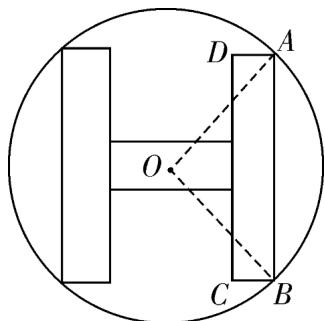

<!-- question-source:start -->
17. 某工厂制作如图所示的一种标识，在半径为 $3$ 的圆内做一个关于圆心对称的“H”型图形，“H”型图形由两

竖一横三个等宽的矩形组成，两个竖起来的矩形全等且它们的长边是横向矩形长边的 $\frac{3}{2}$ 倍，设 $O$ 为圆心，

$\angle AOB = 2\alpha$ ，记矩形 $ABCD$ 的面积为 $\mathrm{S}$ ，则 $\mathrm{S}$ 的最大值为

<!-- question-source:end -->

![[高中/课堂同步/题库/人教A版高中数学同步讲义(2026)/01_必修第一册/第五章 三角函数/专题5.5三角恒等变换（高效培优讲义）数学人教A版2019高一必修第一册/强化训练/questions/answers/Q00076762A1.md]]
