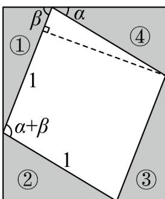
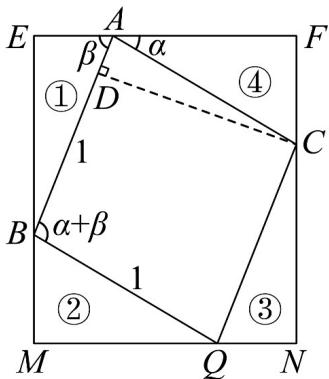

> [!faq]- 《专题5.5三角恒等变换（高效培优讲义）数学人教A版2019高一必修第一册》官方解析
>
> > [!success]- **【答案】** A．直角三角形 B．锐角三角形 C．钝角三角形 D．等腰三角形
>
> > [!note]- **【解析】**
> > 因为方程 $x^{2} - ax + a + 3 = 0$ 有两根 $\tan A$ ， $\tan B$
> >
> > 所以 $\left\{ \begin{array}{l} \tan A + \tan B = a \\ \tan A \cdot \tan B = a + 3 \end{array} \right.$ ，所以 $\tan (A + B) = \frac{\tan A + \tan B}{1 - \tan A \cdot \tan B} = \frac{a}{1 - (a + 3)} = \frac{a}{-a - 2} (a \neq -2)$
> >
> > 且 $\Delta = a^{2} - 4(a + 3)$ $0 \Rightarrow a$ 6 或 a < -2.
> >
> > 所以 $\tan (A + B) = \frac{a}{-a - 2} < 0$
> >
> > 因为 $A + B = \pi - C$ ，所以 $\tan(A + B) = \tan(\pi - C) = -\tan C < 0$ ，从而可得 $\tan C > 0$ ，
> > 所以 $0 < C < \frac{\pi}{2}$ .
> >
> > 当 $a = 6$ 时， $\tan A \cdot \tan B > 0$ ，所以 $0 < A < \frac{\pi}{2}$ ， $0 < B < \frac{\pi}{2}$ ，此时VABC锐角三角形
> >
> > 当 $a < -3$ 时， $\tan A \cdot \tan B < 0$ ，可知 $A, B$ 中有一个钝角，些时 $\mathrm{V}ABC$ 钝角三角形
> >
> > 若 $\tan A = \tan B$ ，则 $A = B$ ，此时 $\tan A = \tan B = \frac{a}{2}$ ，所以 $\frac{a}{2} \cdot \frac{a}{2} = a + 3$ ，解得 $a = 6$ 或 $a = -2$ （舍），
> >
> > 当 a = 6 时，VABC 是等腰三角形.
> >
> > 因此，VABC可能是锐角三角形、钝角三角形、等腰三角形
> >
> > 故选：BCD
> >
> > 15. 四个直角三角形可以多种拼接方式。如图就是一种拼接方式：其中直角三角形①和直角三角形③全等，
> >
> > 直角三角形②和直角三角形④全等，其中直角三角形的斜边长为 $^{1}$ 个单位长度，根据图所提供的信息，请写
> >
> > 出一个关于角 $\alpha$ 和角 $\beta$ 组合在一起的一个数学公式 \_\_\_\_.
> >
> > 
> >
> > 【答案】 $\sin (\alpha +\beta) = \sin \alpha \cos \beta +\cos \alpha \sin \beta$
> >
> > 【详解】由题意可知，四边形 MNFE 为矩形，四边形 ABQC 为菱形，
> >
> > 过点 C 作 $CD_{\perp}AB$ 于点 D，故 $\angle BAC = \pi - \alpha - \beta$
> >
> > 因为 AC = 1 ，所以 $\sin \angle BAC = \sin (\pi - \alpha - \beta) = \sin (\alpha + \beta) = CD$
> >
> > 故菱形 $ABQC$ 的面积为 $AB\cdot CD = \sin (\alpha +\beta)$
> >
> > $$
> > \text {在} ^ {\mathrm{Rt}} \triangle A B E \text {中,} A B = 1, \sin \angle B A E = \frac {B E}{A B}, \cos \angle B A E = \frac {A E}{A B}
> > $$
> >
> > $$
> > \text {故} B E = \sin \beta , A E = \cos \beta , S _ {\triangle A B E} = \frac {1}{2} B E \cdot A E = \frac {1}{2} \sin \beta \cos \beta
> > $$
> >
> > 在 Rt△BMQ 中，BQ=1， $\sin\angle MQB=\frac{BM}{BQ}$ ， $\cos\angle MQB=\frac{MQ}{BQ}$
> >
> > 故 $BM = \sin \alpha$ ， $MQ = \cos \alpha$ ， $S_{\triangle BMQ} = \frac{1}{2} BM\cdot MQ = \frac{1}{2}\sin \alpha \cos \alpha$
> >
> > $$
> > \text {又} E M = E B + B M = \sin \beta + \sin \alpha , E F = E A + A F = E A + M Q = \cos \beta + \cos \alpha
> > $$
> >
> > 故矩形 MNFE 的面积为 $EM \cdot EF = (\sin \beta + \sin \alpha) (\cos \beta + \cos \alpha)$
> >
> > $= \sin \beta \cos \beta +\sin \beta \cos \alpha +\sin \alpha \cos \beta +\sin \alpha \cos \alpha$
> >
> > 又矩形 MNFE 的面积为
> >
> > $$
> > \sin (\alpha + \beta) + 2 S _ {\triangle B M Q} + 2 S _ {\triangle A B E} = \sin (\alpha + \beta) + \sin \alpha \cos \alpha + \sin \beta \cos \beta
> > $$
> >
> > 故 $\sin \beta \cos \beta + \sin \beta \cos \alpha + \sin \alpha \cos \beta + \sin \alpha \cos \alpha$
> >
> > $= \sin (\alpha +\beta) + \sin \alpha \cos \alpha +\sin \beta \cos \beta$
> >
> > 故 $\sin(\alpha+\beta)=\sin\alpha\cos\beta+\cos\alpha\sin\beta$
> >
> > 
> >
> > 故答案为： $\sin (\alpha +\beta) = \sin \alpha \cos \beta +\cos \alpha \sin \beta$
