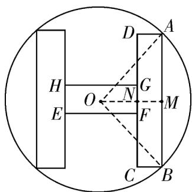

> [!faq]- 《专题5.5三角恒等变换（高效培优讲义）数学人教A版2019高一必修第一册》官方解析
>
> > [!success]- **【答案】** $3\sqrt{13} - 6$
>
> > [!note]- **【解析】**
> > 过点 O 作 $OM \perp AB$ ，垂足为 M，设 OM 交 CD 于点 N，
> >
> > 则 M 、 N 分别为 AB 、 CD 的中点·
> >
> > 设四边形 EFGH 为横向矩形，如图所示，
> >
> > 
> >
> > 由题意可知， $0 < 2\alpha < \pi$
> >
> > 因为 $AB = 2AM = 6\sin \alpha$ ， $AB = \frac{3}{2} EF$ ，所以 $EF = \frac{2}{3} AB = 4\sin \alpha$
> >
> > $AD = MN = OM - ON = OM - \frac{1}{2} EF = 3\cos \alpha - 2\sin \alpha$ 所以
> >
> > 所以矩形 ABCD 的面积 $S = 6 \sin \alpha \times (3 \cos \alpha - 2 \sin \alpha) = 9 \sin 2\alpha - 12 \sin^{2} \alpha = 9 \sin 2\alpha - 12 \times \frac{1 - \cos 2\alpha}{2}$
> >
> > $= 9\sin 2\alpha + 6\cos 2\alpha - 6 = 3\sqrt{13}\sin (2\alpha + \varphi) - 6$ ，其中 $\tan \varphi = \frac{2}{3}$ ，且 $\varphi$ 为锐角，
> >
> > 因为 $0 < 2\alpha < \pi$ ，则 $\varphi < 2\alpha + \varphi < \pi + \varphi$
> >
> > 故当 $2\alpha + \varphi = \frac{\pi}{2}$ 时，即当 $\sin(2\alpha + \varphi) = 1$ 时，S 取得最大值为 $3\sqrt{13} - 6$ .
> >
> > 故答案为： $3\sqrt{13}-6$
