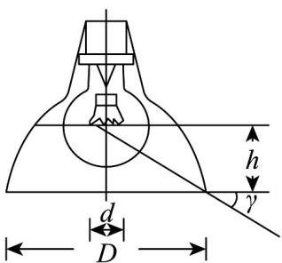

<!-- question-source:start -->
【典例1】给白炽灯加上一个不透光材料做的灯罩，可以降低或消除白炽灯对眼睛造成的眩光，某一灯罩的

防止眩光范围，可用遮光角 $\gamma$ 来衡量·遮光角是指灯罩边沿和发光体边沿的连线与水平线所成的夹角，图中灯

罩的遮光角 $\gamma$ 满足 $\tan \gamma = \frac{3h}{D + d}$ 若图中 $D = 208, d = 12$ ，且 $\cos 2\gamma = \frac{7}{25}$ ，则 $h = (\quad)$

A.21 B.33 C.42 D.55
<!-- question-source:end -->

![[高中/课堂同步/题库/人教A版高中数学同步讲义(2026)/01_必修第一册/第五章 三角函数/专题5.5三角恒等变换（高效培优讲义）数学人教A版2019高一必修第一册/题型03_二倍角公式的简单应用/questions/answers/Q00076712A1.md]]
