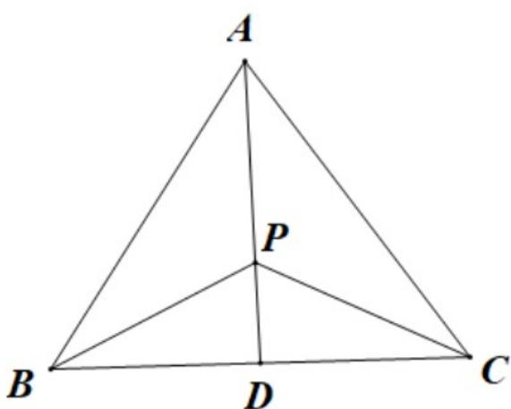

> [!faq]- 《专题5.5三角恒等变换（高效培优讲义）数学人教A版2019高一必修第一册》官方解析
>
> > [!success]- **【答案】** A. $\frac{5\pi}{12}$ B. $\frac{\pi}{3}$ C. $\frac{\pi}{4}$ D. $\frac{\pi}{6}$
>
> > [!note]- **【解析】**
> > 取 BC 的中点 D，由 VABC 的重心为点 P，可得 $\overline{AP} = 2\overline{PD}$ ，又 $\overline{PB} + \overline{PC} = 2\overline{PD}$ ，所以
> >
> > $$
> > P A = - P B - P C
> > $$
> >
> > 所以 $\sqrt{3}\sin A\cdot\left(-\overline{PB}-\overline{PC}\right)+\sqrt{3}\sin B\cdot\overline{PB}+\sin C\cdot\overline{PC}=0$
> >
> > 即 $\overline{PB}\cdot\left(\sqrt{3}\sin B-\sqrt{3}\sin A\right)+\overline{PC}\cdot\left(\sin C-\sqrt{3}\sin A\right)=0$
> >
> > 因为 $\frac{\sqrt{3}}{PB},\frac{\sqrt{3}}{PC}$ 不共线，所以 $\left\{ \begin{array}{l} \sqrt{3}\sin B - \sqrt{3}\sin A = 0\\ \sin C - \sqrt{3}\sin A = 0 \end{array} \right.$
> >
> > 故 $\left\{ \begin{array}{l} B = A \\ \sin C = \sqrt{3} \sin A = \sqrt{3} \sin B \end{array} \right.$
> >
> > 所以 $\sin C = \sin (A + B) = \sin 2B = 2\sin B\cos B$ ，故 $2\sin B\cos B = \sqrt{3}\sin B$
> >
> > 又 $\sin B \neq 0$ ，所以 $\cos B = \frac{\sqrt{3}}{2}$
> >
> > 因为 $B \in (0, \pi)$ ，所以 $B = \frac{\pi}{6}$ .
> >
> > 故选：D.
> >
> > 
