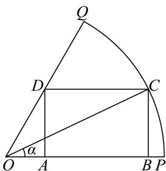

<!-- question-source:start -->
【变式2】如图，已知扇形 $OPQ$ 的半径为 $2$ ，面积为 $\frac{2\pi}{3}$ ， $C$ 是扇形弧上的动点，四边形ABCD是扇形的内

接矩形（点A、B在半径OP上，点D在半径 $OQ$ 上）.

(1)求弧 $PQ$ 的长.

(2)记 $\angle POC = \alpha$ ，当 $\alpha$ 取何值时，矩形ABCD的面积最大?并求出这个最大面积
<!-- question-source:end -->

![[高中/课堂同步/题库/人教A版高中数学同步讲义(2026)/01_必修第一册/第五章 三角函数/专题5.5三角恒等变换（高效培优讲义）数学人教A版2019高一必修第一册/题型11_三角恒等变换在实际问题中的应用/questions/answers/Q00076746A1.md]]
