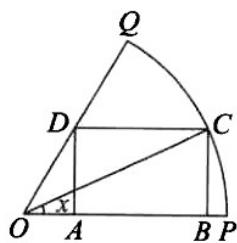

<!-- question-source:start -->
【变式3】如图，在扇形 $OPQ$ 中，半径 $OP = 1$ ，圆心角 $\angle POQ = \frac{\pi}{3}$ ， $C$ 是扇形弧上的动点，矩形ABCD内接

于扇形，记 $\angle POC = x$ ，矩形ABCD的面积为 $f(x)$

(1)求 $f(x)$ ;

(2)求 $f(x)$ 的最大值及此时x的值；

(3)若 $f(x)\frac{\sqrt{6} - \sqrt{3}}{6}$ ，求 $x$ 的取值范围.
<!-- question-source:end -->

![[高中/课堂同步/题库/人教A版高中数学同步讲义(2026)/01_必修第一册/第五章 三角函数/专题5.5三角恒等变换（高效培优讲义）数学人教A版2019高一必修第一册/题型11_三角恒等变换在实际问题中的应用/questions/answers/Q00076747A1.md]]
