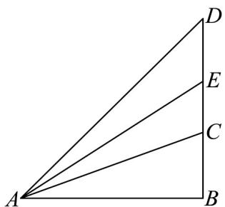
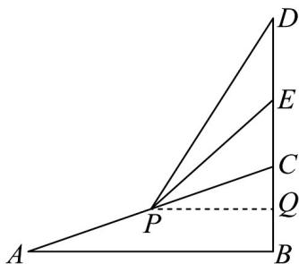

> [!faq]- 《专题5.5三角恒等变换（高效培优讲义）数学人教A版2019高一必修第一册》官方解析
>
> > [!success]- **【答案】** B
>
> > [!note]- **【解析】**
> > 由题意， $E$ 为 $CD$ 的中点，由 $DE = 5$ ，得 $EC = 5$ ，当人在A点时，如下图所示，
> >
> > 
> >
> > 设 $BC = x$ ，则 $AB = \sqrt{3} x, AC = 2x$
> >
> > 在 $\triangle DAB$ 中， $\tan \angle DAB = \frac{10 + x}{\sqrt{3}x}$
> >
> > 在 $\triangle EAB$ 中， $\tan \angle EAB = \frac{5 + x}{\sqrt{3}x}$
> >
> > 因为 $\tan \angle DAB = \tan (\angle DAE + \angle EAB) = \frac{\tan\angle DAE + \tan\angle EAB}{1 - \tan\angle DAE\cdot\tan\angle EAB}$ 所以 $\frac{\frac{\sqrt{3}}{9} + \frac{5 + x}{\sqrt{3}x}}{1 - \frac{\sqrt{3}}{9}\times\frac{5 + x}{\sqrt{3}x}} = \frac{10 + x}{\sqrt{3}x}$ ，解得 $x = \frac{5}{2}$ 或 $x = 5$
> >
> > 因为 $AC > 5$ ，所以 $x > \frac{5}{2}$ ，则 $BC = 5$ ，则 $AB = 5\sqrt{3}$
> >
> > 当人运动到 $AC$ 中点 $P$ 时，作 $PQ \perp BC$ 于点 $Q$ ，如下图所示，
> >
> > 则 $PQ = \frac{1}{2} AB = \frac{5\sqrt{3}}{2}, CQ = \frac{5}{2}$
> >
> > 所以 $EQ = EC + CQ = 5 + \frac{5}{2} = \frac{15}{2}$ ，
> >
> > 在 Rt△PQE 中， $PE=\sqrt{PQ^{2}+QE^{2}}=\sqrt{\left(\frac{5\sqrt{3}}{2}\right)^{2}+\left(\frac{15}{2}\right)^{2}}=5\sqrt{3}$
> >
> > 故选：B.
> >
> > 
> >
> > ## 方法技巧
> >
> > 解决这类问题的关键是巧妙设元，使其他各有关的量均能用 $\alpha$ 表示，建立关于 $\alpha$ 的函数，再运用倍角公式、和角公式．构成函数，然后进行三角变换求解是解决此类问题的常用方法．注意数形结合思想在解决题中的应用．
