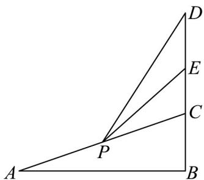

<!-- question-source:start -->
【典例1】某大型商场为迎接新年的到来，在自动扶梯 $AC$ （ $AC > 5$ ）的 $C$ 点的上方悬挂竖直高度为 $^5$ 米的

广告牌 $DE$ ，如图所示，广告牌底部点 $E$ 正好为 $DC$ 的中点，电梯 $AC$ 的坡度 $\angle CAB = 30^{\circ}$ 。当人在A点时，

观测到视角 $\angle DAE$ 的正切值为 $\frac{\sqrt{3}}{9}$ 。当人运动到 $AC$ 中点 $P$ 时， $PE = (\quad)$

A. $5\sqrt{7}$ B. $5\sqrt{3}$ C. 5 D. $2\sqrt{5}$
<!-- question-source:end -->

![[高中/课堂同步/题库/人教A版高中数学同步讲义(2026)/01_必修第一册/第五章 三角函数/专题5.5三角恒等变换（高效培优讲义）数学人教A版2019高一必修第一册（解析版）/_compact/answers/Q00075210A1.md]]
