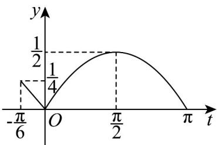

> [!faq]- 《专题5.5三角恒等变换（高效培优讲义）数学人教A版2019高一必修第一册（解析版）》官方解析
>
> > [!success]- **【答案】** (1) $\pi$ (2)① $\frac{1}{4}<m<\frac{1}{2}$ 或 m=0 $\frac{\pi}{4}$
>
> > [!note]- **【解析】**
> > （1） $f(x) = \sin^2\left(x + \frac{\pi}{8}\right) + \sqrt{2}\sin \left(x + \frac{\pi}{4}\right)\cdot \cos \left(x + \frac{\pi}{4}\right) - \frac{1}{2}$
> >
> > $$
> > = \frac {1 - \cos \left(2 x + \frac {\pi}{4}\right)}{2} + \frac {\sqrt {2}}{2} \sin \left(2 x + \frac {\pi}{2}\right) - \frac {1}{2}
> > $$
> >
> > $$
> > = \frac {1}{2} - \frac {\sqrt {2}}{4} \cos 2 x + \frac {\sqrt {2}}{4} \sin 2 x + \frac {\sqrt {2}}{2} \cos 2 x - \frac {1}{2}
> > $$
> >
> > $$
> > = \frac {\sqrt {2}}{4} \sin 2 x + \frac {\sqrt {2}}{4} \cos 2 x = \frac {1}{2} \sin \left(2 x + \frac {\pi}{4}\right)
> > $$
> >
> > ∴ $f(x)$ 的最小正周期为 $T = \frac{2\pi}{2} = \pi$ 即为所求.
> >
> > (2)
> >
> > 
> > - **①**：令 $t = 2x + \frac{\pi}{4}$ ，其中 $x$ 与 $t$ 是一一对应的，
> >
> > 当 $x\in \left[-\frac{5\pi}{24},\frac{3\pi}{8}\right]$ 时， $t\in \left[-\frac{\pi}{6},\pi \right]$
> >
> > $$
> > \frac {1}{2} \sin t \in \left[ - \frac {1}{4}, \frac {1}{2} \right]
> > $$
> >
> > 所以 $y=\left|\frac{1}{2}\sin t\right|\in\left[0,\frac{1}{2}\right]$ ，如图，
> >
> > 要使 $y = |f(x)| - m$ 在区间 $\left[-\frac{5\pi}{24}, \frac{3\pi}{8}\right]$ 上恰有两个零点
> >
> > 等价于 $y=\left|\frac{1}{2}\sin t\right|$ 的图象与直线 y=m 在 $t\in\left[-\frac{\pi}{6},\pi\right]$ 有两个交点，
> >
> > 所以要使 $y = |f(x)| - m$ 在区间 $\left[-\frac{5\pi}{24}, \frac{3\pi}{8}\right]$ 上恰有两个零点，
> >
> > $m$ 的取值范围为 $\frac{1}{4} < m < \frac{1}{2}$ 或 $m = 0$ ；
> > - **②**：设 $t_1, t_2$ 是函数 $y = \left|\frac{1}{2} \sin t\right| - m$ 的两个零点（即 $t_1 = 2x_1 + \frac{\pi}{4}, t_2 = x_2 + \frac{\pi}{4}$ ）
> >
> > 由正弦函数图象对称性可知 $t_1 + t_2 = \pi$
> >
> > 即 $2x_{1}+\frac{\pi}{4}+2x_{2}+\frac{\pi}{4}=\pi$ ，所以 $x_{1}+x_{2}=\frac{\pi}{4}$ .
