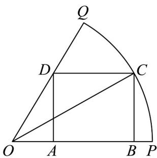

> [!faq]- 《专题5.5三角恒等变换（高效培优讲义）数学人教A版2019高一必修第一册（解析版）》官方解析
>
> > [!success]- **【答案】**  A. $\frac{\sqrt{5}}{5}$ B. $\frac{2\sqrt{5}}{5}$ C. $\frac{\sqrt{10}}{10}$ D. $\frac{3\sqrt{10}}{10}$
>
> > [!note]- **【解析】**
> > 由题意，因为半径为 $^{1}$ ，所以 $\sin\theta=\frac{BC}{OC}=BC,\quad\cos\theta=\frac{OB}{OC}=OB$
> >
> > 因为 $\cos \alpha = \frac{3}{5} > 0$ ， $\alpha \in (0, \frac{\pi}{2})$ ，所以 $\sin \alpha = \sqrt{1 - \cos^2 \alpha} = \frac{4}{5}$ ，
> >
> > 所以 $\tan \alpha = \frac{4}{3} = \frac{AD}{OA} = \frac{BC}{OA}$ ，所以 $OA = \frac{3BC}{4} = \frac{3}{4}\sin \theta$
> >
> > 所以 $AB = OB - OA = \cos \theta -\frac{3}{4}\sin \theta$
> >
> > $$
> > S = B C \square A B = \sin \theta (\cos \theta - \frac {3}{4} \sin \theta) = \sin \theta \cos \theta - \frac {3}{4} \sin^ {2} \theta = \frac {1}{2} \sin 2 \theta + \frac {3}{8} \cos 2 \theta - \frac {3}{8}
> > $$
> >
> > $= \frac{5}{8} (\frac{4}{5}\sin 2\theta +\frac{3}{5}\cos 2\theta) - \frac{3}{8} = \frac{5}{8}\sin (2\theta +\varphi) - \frac{3}{8}$ ，其中 $\sin \varphi = \frac{3}{5},\cos \varphi = \frac{4}{5}$
> >
> > 当 $\sin (2\theta +\varphi) = 1$ 时，S取最大值，则 $\cos (2\theta +\varphi) = \sqrt{1 - \sin^2(2\theta +\varphi)} = 0$
> >
> > 所以 $\cos2\theta=\cos[(2\theta+\varphi)-\varphi]=\cos(2\theta+\varphi)\cos\varphi+\sin(2\theta+\varphi)\sin\varphi=\frac{3}{5}$
> >
> > 所以 $\cos 2\theta = 2\cos^2\theta -1 = \frac{3}{5}$ ，解得 $\cos^2\theta = \frac{4}{5}$ ， $\sin^2\theta = \frac{1}{5}$
> >
> > 因为 $0 < \theta < \alpha < \frac{\pi}{2}$ ，所以 $\sin\theta = \frac{\sqrt{5}}{5} < \sin\alpha = \frac{4}{5}$ ，满足题意，
> >
> > 所以当矩形ABCD的面积最大时， $\sin \theta = \frac{\sqrt{5}}{5}$
> >
> > 故选 **A**.
