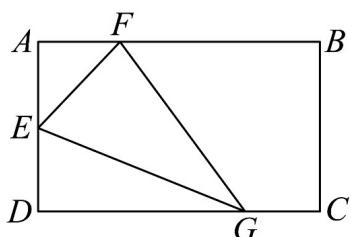

<!-- question-source:start -->
【变式3】为持续推进“改善农村人居环境，建设宜居美丽乡村”，某村委计划在该村一矩形空地进行绿化，

如图所示， $AD = 2n\cdot$ 点 $E$ 是 $AD$ 中点， $F$ ， $G$ 分别是线段 $AB$ 和线段 $DC$ 上的动点（ $DC$ 足够长），

$$
\angle F E G = 6 0 ^ {\circ}
$$

(1) 当 $DG = \sqrt{3} n$ 时，求 $\triangle AEF$ 的面积；

(2)求 $\triangle EFG$ 面积的最小值·
<!-- question-source:end -->

![[高中/课堂同步/题库/人教A版高中数学同步讲义(2026)/01_必修第一册/第五章 三角函数/专题5.5三角恒等变换（高效培优讲义）数学人教A版2019高一必修第一册（解析版）/题型08_三角恒等式的证明/questions/answers/Q00075201A1.md]]
