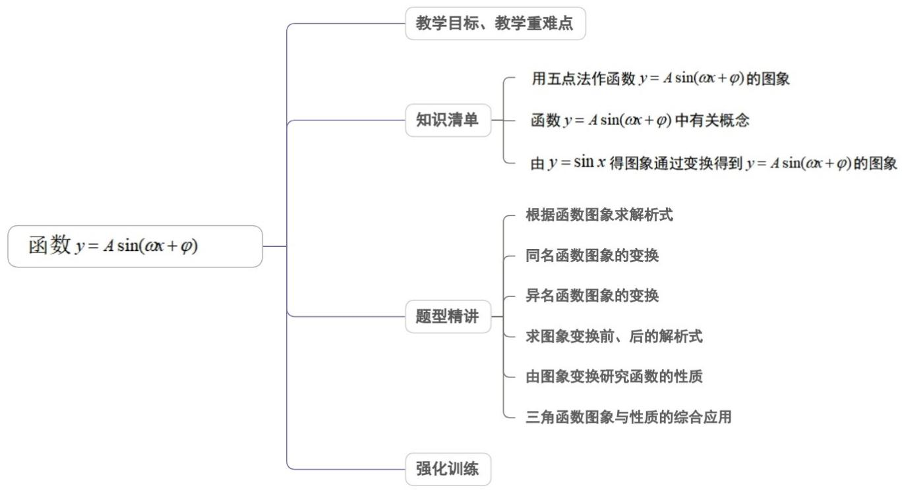
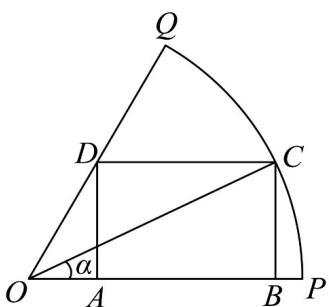
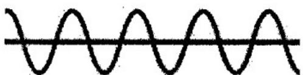
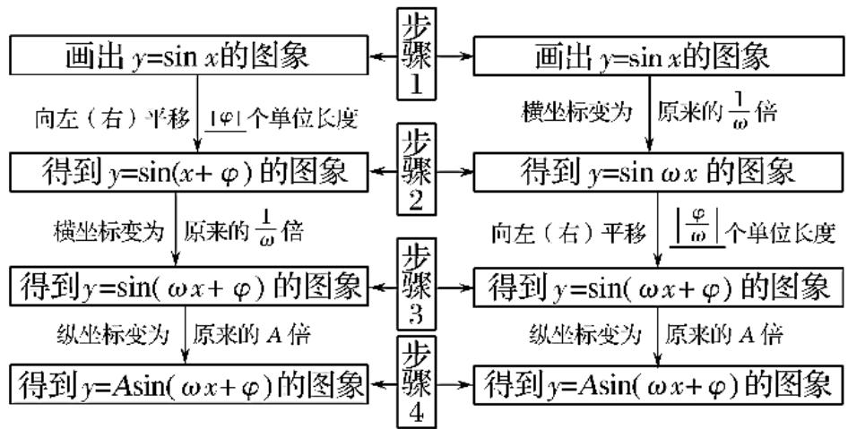

<!-- source-part:1 pages:1-50 -->

专题5.6 函数 $y = A\sin (\omega x + \varphi)$

## 内容概览

## 教学目标、教学重难点

<table><tr><td>教学目标</td><td>1.掌握图象的变换规律,解决三角函数的变换问题。2.灵活掌握平移、伸缩变换规律,掌握与函数 $y = A \sin(\omega x + \varphi)$ 中变换量之间的关系。3.会利用图象的特点求函数的解析式。4.会求图象变换前后函数的解析式。5.会解决与三角函数有关的综合问题。</td></tr><tr><td>教学重难点</td><td>1.重点:会画函数的图象,会结合图象解决与函数有关的性质问题,会求函数的解析式。2.难点:掌握函数图象的变换规律。</td></tr></table>

## 知识清单

知识点01 用五点法作函数 $y = A\sin (\omega x + \varphi)$ 的图象

用“五点法”作 $y = A\sin (\omega x + \varphi)$ 的简图，主要是通过变量代换，设 $z = \omega x + \varphi$ ，由 $z$ 取 $0, \frac{\pi}{2}, \pi, \frac{3}{2}\pi, 2\pi$ 来求出相

应的 $x$ ，通过列表，计算得出五点坐标，描点后得出图象.

【即学即练】

1. 某公园要在一块扇形区域中设计一块矩形草坪，如图所示，在扇形 $OPQ$ 中，半径 $OP = 60$ 米，圆心角

$\angle POQ = \frac{\pi}{3}$ ， $C$ 是扇形弧上的动点，矩形ABCD内接于扇形·记 $\angle POC = \alpha$ ，矩形草坪ABCD的面积为 $S$ 平方

米·则面积 S 的最大值为（）平方米·

A. $600\sqrt{3}$ B. $300\sqrt{3}$ C. $600\sqrt{2}$ D. $500\sqrt{2}$

【答案】A

【详解】因为 $OP = 60$ ， $\angle POQ = \frac{\pi}{3}$ ，所以 $BC = 60\sin \alpha ,OB = 60\cos \alpha$ ， $AO = \frac{60\sin\alpha}{\tan\frac{\pi}{3}} = 20\sqrt{3}\sin \alpha$ ，所以

$$
A B = O B - O A = 6 0 \cos \alpha - 2 0 \sqrt {3} \sin \alpha
$$

则四边形 $ABCD$ 的面积为 $S = AB \times BC = (60\cos \alpha - 20\sqrt{3}\sin \alpha)60\sin \alpha$

所以 $S = 1200\left(3\cos \alpha -\sqrt{3}\sin \alpha\right)\sin \alpha$

$$
y = (3 \cos \alpha - \sqrt {3} \sin \alpha) \sin \alpha = 3 \cos \alpha \sin \alpha - \sqrt {3} \sin^ {2} \alpha = \frac {3}{2} \sin 2 \alpha - \frac {\sqrt {3}}{2} (1 - \cos 2 \alpha)
$$

$$
= \frac {3}{2} \sin 2 \alpha + \frac {\sqrt {3}}{2} \cos 2 \alpha - \frac {\sqrt {3}}{2} = \sqrt {3} \left(\frac {\sqrt {3}}{2} \sin 2 \alpha + \frac {1}{2} \cos 2 \alpha\right) - \frac {\sqrt {3}}{2}
$$

$$
= \sqrt {3} \left(\sin 2 \alpha \cos \frac {\pi}{6} + \cos 2 \alpha \sin \frac {\pi}{6}\right) - \frac {\sqrt {3}}{2} = \sqrt {3} \sin \left(2 \alpha + \frac {\pi}{6}\right) - \frac {\sqrt {3}}{2}
$$

因为 $0 < \alpha < \frac{\pi}{3}$ ，所以 $\frac{\pi}{6} < 2\alpha + \frac{\pi}{6} < \frac{5\pi}{6}$ ，所以 $\frac{1}{2} < \sin \left(2\alpha + \frac{\pi}{6}\right) \leq 1$

所以当 $\sin \left(2\alpha +\frac{\pi}{6}\right) = 1$ 时， $y$ 的最大值为 $\sqrt{3} -\frac{\sqrt{3}}{2} = \frac{\sqrt{3}}{2}$

所以面积 S 的最大值为 $600\sqrt{3}$ .

故选：A.

2. 已知函数 $f(x) = \sin (\omega x + \frac{3\pi}{4})(\omega > 0)$ ，对任意的 $x \in \mathbb{R}$ 恒有 $f(x) \leq \left|f\left(\frac{\pi}{3}\right)\right|$ ，且在区间 $(0, \frac{\pi}{6})$ 上有且只有一个

$x_0$ 使得 $f(x_0) = \frac{\sqrt{2}}{2}$ ，则 $\omega$ 的值可以是（ ）A. $\frac{9}{4}$ B. $\frac{15}{4}$ C. $\frac{21}{4}$ D. $\frac{45}{4}$

【答案】D

【详解】依题意，得 $\frac{\pi}{3}\omega +\frac{3\pi}{4} = k\pi +\frac{\pi}{2}(k\in Z)$

解得 $\omega = 3k - \frac{3}{4}(k \in \mathbb{Z})$ ，且 $\omega > 0.①$

当 $x\in \left(0,\frac{\pi}{6}\right)$ 时， $\omega x + \frac{3\pi}{4}\in \left(\frac{3\pi}{4},\frac{\pi}{6}\omega +\frac{3\pi}{4}\right)(k\in Z)$

又 $f(x)$ 在区间 $\left(0, \frac{\pi}{6}\right)$ 上有且只有一个 $x_0$ 使得 $f(x_0) = \frac{\sqrt{2}}{2}$

故 $\frac{9\pi}{4} < \frac{\pi}{6}\omega + \frac{3\pi}{4} \leq \frac{11\pi}{4}$ ，解得 $9 < \omega \leq 12.$ ②。联立①②，解得 $\omega = \frac{45}{4}$

故选：D.

## 知识点 02 函数 $y = A \sin(\omega x + \varphi)$ 中有关概念

$y = A \sin(\omega x + \varphi) (A > 0, \omega > 0)$ 表示一个振动量时， $A$ 叫做振幅， $T = \frac{2\pi}{\omega}$ 叫做周期， $f = \frac{1}{T} = \frac{\omega}{2\pi}$ 叫做频率， $\omega x + \varphi$ 叫做相位， $x = 0$ 时的相位 $\varphi$ 称为初相。

## 【即学即练】

1. 我们在用微信语音通话时，手机话筒采集到的声音信号是一段类似正弦函数图像的声波曲线（如图所示），

已知该声波曲线 $y = A\sin (\omega x + \varphi)$ （其中 $A > 0, \omega > 0, 0 \leq \varphi < 2\pi$ ）的振幅A为4，周期T为π，初相位 $\varphi$ 为 $\frac{\pi}{3}$ ，

则该声波曲线的解析式可能是（已知周期公式： $T=\frac{2\pi}{\omega}$ ）（

A. $y = 4\sin \left(\pi x + \frac{\pi}{3}\right)$ B. $y = 4\sin \left(2x + \frac{\pi}{3}\right)$

C. $y = 2\sin \left(\pi x + \frac{\pi}{3}\right)$ D. $y = 2\sin \left(2x + \frac{\pi}{3}\right)$

【答案】B

【详解】由题意可知， $A = 4$ ， $\frac{2\pi}{\omega} = \pi$ ，即 $\omega = 2$ ， $\varphi = \frac{\pi}{3}$

所以函数的解析式为 $y = 4\sin\left(2x + \frac{\pi}{3}\right)$ .

故选：B

2. 函数 $y = -2\sin\left(\frac{\pi}{4} - \frac{x}{2}\right)$ 的振幅为（） A. $\frac{1}{2}$ B. $\frac{\pi}{4}$ C. -2 D. 2

【答案】D

【详解】因为该函数符合 $f(x) = A\sin (\omega x + \varphi)$ 的形式，所以函数 $y = -2\sin \left(\frac{\pi}{4} - \frac{x}{2}\right)$ 的振幅为 2

故选：D.

知识点 03 由 $y = \sin x$ 得图象通过变换得到 $y = A \sin (\omega x + \varphi)$ 的图象

1、振幅变换： $y = A \sin x$ ， $x \in R$ （ $A > 0$ 且 $A \neq 1$ ）的图象可以看作把正弦曲线上的所有点的纵坐标伸长（ $A > 1$ ）或缩短（ $0 < A < 1$ ）到原来的 $A$ 倍得到的（横坐标不变），它的值域 $[-A, A]$ ，最大值是 $A$ ，最小值是 - $A$ 。若 $A < 0$ 可先作 $y = -A \sin x$ 的图象，再以 $x$ 轴为对称轴翻折， $A$ 称为振幅。

2、周期变换：函数 $y = \sin \omega x$ ， $x \in R$ （ $\omega > 0$ 且 $\omega \neq 1$ ）的图象，可看作把正弦曲线上所有点的横坐标缩短

$(\omega > 1)$ 或伸长 $(0 < \omega < 1)$ 到原来的 $\frac{1}{\omega}$ 倍（纵坐标不变）．若 $\omega < 0$ 则可用诱导公式将符号“提出”再作图． $\omega$ 决

定了函数的周期．

3、相位变换：函数 $y = \sin(x + \varphi)$ ， $x \in R$ （其中 $\varphi \neq 0$ ）的图象，可以看作把正弦曲线上所有点向左（当 $\varphi > 0$ 时）或向右（当 $\varphi < 0$ 时）平行移动 $|\varphi|$ 个单位长度而得到。（用平移法注意讲清方向：“左加右减”）。

4、函数 $y = \sin x$ 的图象经变换得到 $y = A\sin (\omega x + \varphi)$ 的图象的两种途径

## 【即学即练】

1. 把函数 $f(x) = \sin x$ 的图象向左平移 $\frac{\pi}{3}$ 个单位长度，再把横坐标变为原来的 $\frac{1}{2}$ 倍（纵坐标不变）得到函数

$g(x)$ 的图象，则函数 $g(x) =$ （ ）A. $\sin \left(2x - \frac{\pi}{3}\right)$ B. $\sin \left(2x + \frac{\pi}{3}\right)$ C. $\sin \left(\frac{1}{2} x + \frac{\pi}{3}\right)$ D. $\sin \left(\frac{1}{2} x - \frac{\pi}{3}\right)$

【答案】B

【详解】把函数 $f(x) = \sin x$ 的图象向左平移 $\frac{\pi}{3}$ 个单位长度，再把横坐标变为原来的 $\frac{1}{2}$ 倍（纵坐标不变）得到

函数 $g(x)$ 的图象，

则函数 $\sin \left(2x + \frac{\pi}{3}\right)$

故选：B.

2. 函数 $f(x)=\sin(2x+\varphi)$ 的图象向左平移 $\frac{\pi}{3}$ 个单位得到函数 $g(x)$ 的图象，若函数 $g(x)$ 是奇函数，则 $\tan\varphi=$ () A. $-\sqrt{3}$ B. $\sqrt{3}$ C. $-\frac{\sqrt{3}}{3}$ D. $\frac{\sqrt{3}}{3}$

【答案】B

【详解】由函数 $f(x) = \sin (2x + \varphi)$ 的图象向左平移 $\frac{\pi}{3}$ 个单位得到函数 $g(x)$ 的图象，可得 $g(x) = \sin \left[2\left(x + \frac{\pi}{3}\right) + \varphi\right] = \sin \left(2x + \frac{2\pi}{3} + \varphi\right).$ 因为函数 $g(x)$ 的定义域为 R，且 $g(x)$ 是奇函数，

所以 $g(0) = 0$ ，即 $\sin \left(\frac{2\pi}{3} + \varphi\right) = 0$ 即 $\sin \frac{2\pi}{3} \cos \varphi + \cos \frac{2\pi}{3} \sin \varphi = 0$ 即 $\frac{\sqrt{3}}{2} \cos \varphi - \frac{1}{2} \sin \varphi = 0$ ，所以 $\tan \varphi = \frac{\sin \varphi}{\cos \varphi} = \sqrt{3}$ .

故选：B

## 题型精讲

![[高中/课堂同步/题库/人教A版高中数学同步讲义(2026)/01_必修第一册/第五章 三角函数/专题5.6 函数y＝Asin(ωx＋φ)（高效培优讲义）数学人教A版2019高一必修第一册/题型01_根据函数图象求解析式/题型01_根据函数图象求解析式.md]]
![[高中/课堂同步/题库/人教A版高中数学同步讲义(2026)/01_必修第一册/第五章 三角函数/专题5.6 函数y＝Asin(ωx＋φ)（高效培优讲义）数学人教A版2019高一必修第一册/题型02_同名函数图象的变换/题型02_同名函数图象的变换.md]]
![[高中/课堂同步/题库/人教A版高中数学同步讲义(2026)/01_必修第一册/第五章 三角函数/专题5.6 函数y＝Asin(ωx＋φ)（高效培优讲义）数学人教A版2019高一必修第一册/题型03_异名函数图象的变换/题型03_异名函数图象的变换.md]]
![[高中/课堂同步/题库/人教A版高中数学同步讲义(2026)/01_必修第一册/第五章 三角函数/专题5.6 函数y＝Asin(ωx＋φ)（高效培优讲义）数学人教A版2019高一必修第一册/题型04_求图象变换前_后的解析式/题型04_求图象变换前_后的解析式.md]]
![[高中/课堂同步/题库/人教A版高中数学同步讲义(2026)/01_必修第一册/第五章 三角函数/专题5.6 函数y＝Asin(ωx＋φ)（高效培优讲义）数学人教A版2019高一必修第一册/题型05_由图象变换研究函数的性质/题型05_由图象变换研究函数的性质.md]]
![[高中/课堂同步/题库/人教A版高中数学同步讲义(2026)/01_必修第一册/第五章 三角函数/专题5.6 函数y＝Asin(ωx＋φ)（高效培优讲义）数学人教A版2019高一必修第一册/题型06_三角函数图象与性质的综合应用/题型06_三角函数图象与性质的综合应用.md]]
![[高中/课堂同步/题库/人教A版高中数学同步讲义(2026)/01_必修第一册/第五章 三角函数/专题5.6 函数y＝Asin(ωx＋φ)（高效培优讲义）数学人教A版2019高一必修第一册/强化训练/强化训练.md]]
